<!-- START doctoc generated TOC please keep comment here to allow auto update -->
<!-- DON'T EDIT THIS SECTION, INSTEAD RE-RUN doctoc TO UPDATE -->
**Inhaltsverzeichnis**

- [Zusammenfassung Betriebssysteme](#zusammenfassung-betriebssysteme)
  - [Einführung](#einf%C3%BChrung)
    - [Was ist ein Betriebssystem?](#was-ist-ein-betriebssystem)
    - [Anforderungen an ein Betriebssystem](#anforderungen-an-ein-betriebssystem)
    - [Betriebsarten von Betriebssystem](#betriebsarten-von-betriebssystem)
    - [Aufgaben eines Betriebssystems](#aufgaben-eines-betriebssystems)
    - [Dienste eines Betriebssystems](#dienste-eines-betriebssystems)
    - [Einblick in UNIX](#einblick-in-unix)
    - [Unterbrechungen (_Interrupts_)](#unterbrechungen-interrupts)
  - [Prozesse](#prozesse)
    - [Definition](#definition)
    - [Umgebung eines Prozessors](#umgebung-eines-prozessors)
    - [Verhalten eines Prozesses](#verhalten-eines-prozesses)
    - [Zustände eines Prozesses](#zust%C3%A4nde-eines-prozesses)
  - [Prozessverwaltung](#prozessverwaltung)
    - [Steuerung von Prozessen](#steuerung-von-prozessen)
    - [Scheduling-Strategien](#scheduling-strategien)
    - [Non-preemptive Scheduling-Strategien](#non-preemptive-scheduling-strategien)
    - [Preemptive Scheduling-Strategien](#preemptive-scheduling-strategien)
    - [Prozess-Scheduling in UNIX](#prozess-scheduling-in-unix)
    - [Prozesshierarchie](#prozesshierarchie)
  - [Threads und Prozesse](#threads-und-prozesse)
  - [Kommunikation zwischen Prozessen](#kommunikation-zwischen-prozessen)
    - [Möglichkeiten der Prozesskommunikation](#m%C3%B6glichkeiten-der-prozesskommunikation)
    - [Bedingungen für den gegenseitigen Ausschluss (_mutual exclusion_)](#bedingungen-f%C3%BCr-den-gegenseitigen-ausschluss-mutual-exclusion)
    - [Unterbrechungssperre](#unterbrechungssperre)
    - [Verwendung eines Semaphors](#verwendung-eines-semaphors)
    - [Erzeuger- / Verbraucher-Problem](#erzeuger---verbraucher-problem)
    - [Bewertung des Semaphor-Konzepts](#bewertung-des-semaphor-konzepts)
    - [Kommunikation mittels Nachrichten](#kommunikation-mittels-nachrichten)
    - [Verklemmungen (_Deadlocks_)](#verklemmungen-deadlocks)
  - [Speicherverwaltung](#speicherverwaltung)
    - [Zu bewältigende Aufgaben](#zu-bew%C3%A4ltigende-aufgaben)
    - [Speicherpartitionierung und Fragmentierung](#speicherpartitionierung-und-fragmentierung)
    - [Prozesseinordnungsalgorithmen](#prozesseinordnungsalgorithmen)
    - [Swapping](#swapping)
    - [Der Adressraum](#der-adressraum)
    - [Virtueller Speicher](#virtueller-speicher)
    - [Adressabbildung](#adressabbildung)
    - [Die Seitentabelle](#die-seitentabelle)
    - [Seitenwechselstrategien](#seitenwechselstrategien)
    - [Bewertung des virtuellen Speichers](#bewertung-des-virtuellen-speichers)
  - [Dateien und Dateisysteme](#dateien-und-dateisysteme)
    - [Massenspeicher / Hintergrundspeicher](#massenspeicher--hintergrundspeicher)
    - [Datei-Konzept](#datei-konzept)
    - [Verzeichniskonzept](#verzeichniskonzept)
    - [Verschiedene Varianten von Verzeichnissen](#verschiedene-varianten-von-verzeichnissen)
    - [Operationen auf Dateisystemen](#operationen-auf-dateisystemen)
    - [Implementierung auf Festplatten](#implementierung-auf-festplatten)
    - [Implementierung von Dateisystemen](#implementierung-von-dateisystemen)
    - [Allokationsstrategien vom Dateisystem](#allokationsstrategien-vom-dateisystem)
      - [Zusammenhängende Belegung](#zusammenh%C3%A4ngende-belegung)
      - [Verkettete Belegung](#verkettete-belegung)
      - [Indizierte Belegung](#indizierte-belegung)
      - [Multi-Level-Indexblock](#multi-level-indexblock)
      - [UNIX Inodes](#unix-inodes)
  - [Ein- und Ausgabekonzepte und Bussysteme](#ein--und-ausgabekonzepte-und-bussysteme)
    - [Strategien der Ein- / Ausgabe](#strategien-der-ein---ausgabe)
    - [Kopplung der E/A-Bausteine](#kopplung-der-ea-bausteine)
    - [Kommunikation zwischen CPU und E/A-Geräten](#kommunikation-zwischen-cpu-und-ea-ger%C3%A4ten)
    - [Direct Memory Access (DMA)](#direct-memory-access-dma)
    - [Ablauf eines DMA-Transfers](#ablauf-eines-dma-transfers)
    - [E/A-Scheduling-Strategien](#ea-scheduling-strategien)

<!-- END doctoc generated TOC please keep comment here to allow auto update -->

# Zusammenfassung Betriebssysteme
_geschrieben von Morten Terhart am 24.03.2018_

---

## Einführung
### Was ist ein Betriebssystem?
> _"Als Betriebssystem bezeichnet man die Software, die den Ablauf von Programmen auf der Hardware steuert und die vorhandenen Betriebsmittel verwaltet."_

Siehe dazu folgendes Schema:

_Abbildung 1: Einordnung des Betriebssystems in die Abstraktionsebenen eines Rechners_

### Anforderungen an ein Betriebssystem
* hohe Zuverlässigkeit
* hohe Benutzerfreundlichkeit
* geringe Kosten
* hohe Leistung
* einfache Wartbarkeit

### Betriebsarten von Betriebssystem
1. Klassifikation nach Art der Auftragsbearbeitung
	* Stapelverarbeitung
	* Interaktiver Betrieb
	* Echtzeitbetrieb
2. Weitere Möglichkeit der Klassifikation
	* Einbenutzer- / Mehrbenutzerbetrieb
	* Einprogramm- / Mehrprogrammbetrieb
	* Einprozessor- / Mehrprozessorbetrieb

### Aufgaben eines Betriebssystems
* Steuerung der Eingabe- / Ausgabe-Geräte (u.a. Treiber)
* Bereitstellung eines Dateisystems
* Benutzerschnittstelle
* Verwaltung der Betriebsmittel bei Mehrprogrammbetrieb
* Schutz der Anwenderprogramme bei Mehrprogrammbetrieb

### Dienste eines Betriebssystems
* Benutzerschnittstelle (Kommandozeile)
* Programmausführung
* Ein- und Ausgabeoperationen
* Dateiverwaltung
* Kommunikation (z.B. mit Ein- / Ausgabegeräten oder mit Speicher)
* Fehlerbehandlung / Schutzmechanismen

### Einblick in UNIX

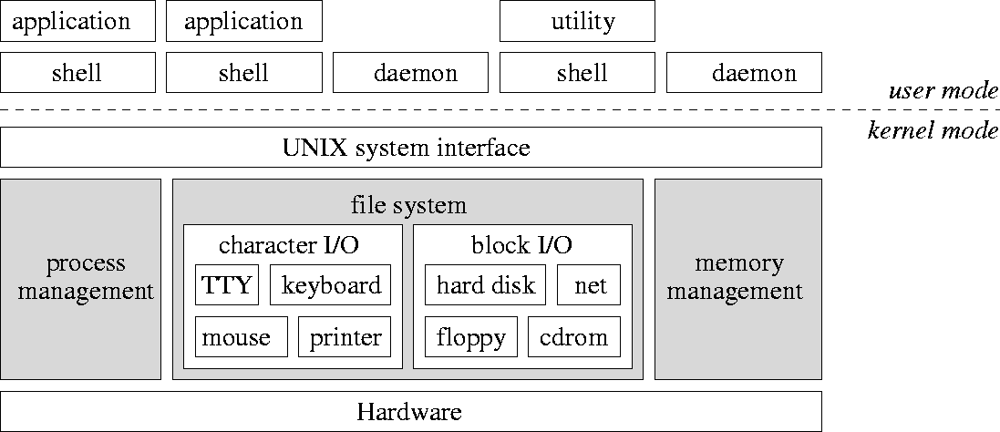
_Abbildung 2: Komponenten von UNIX (oben: Benutzerschnittstelle, unten: System- und Hardwareschicht und Kernel)_

* System- und Benutzerprogramme werden auf gleicher Ebene als Prozesse ausgeführt, haben aber unterschiedliche Zugriffsrechte
* Ein- / Ausgabegeräte werden logisch getrennt behandelt

### Unterbrechungen (_Interrupts_)
* **Ziel**: Direktes Reagieren auf Ereignisse wie Benutzereingaben durch Unterbrechung eines aktiven Prozesses, Parallelität von Ein- / Ausgabe und Programmausführung
	* Dazu wird der Zustand des Prozesses im Hauptspeicher zwischengespeichert und nach Beendigung der Unterbrechung wiederhergestellt.
* **Idee**: Prozessor initialisiert Ein- / Ausgabe, sodass E/A-Werk ein Programm selbstständig ausführen kann

**2 Arten der Unterbrechung**:
* **externe Unterbrechung**: E/A-Werk informiert den Prozessor über Zustand eines E/A-Geräts
* **interne Unterbrechung**: Prozessor führt Ausnahmebehandlungen bei Fehlern durch (z.B. Division durch 0)

**Ablauf einer Unterbrechung**:
* Unterbrechungen werden nur **nach** einer Instruktion behandelt
	* Instruktionen werden nicht unterbrochen

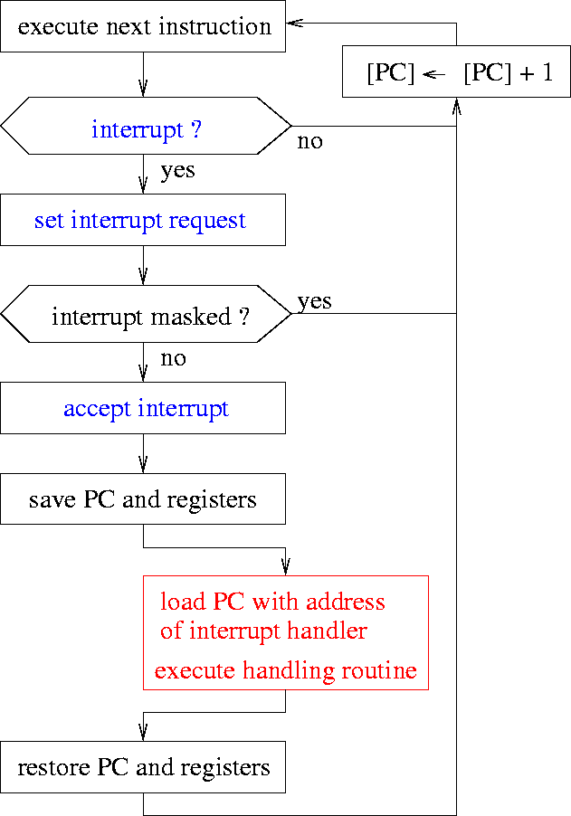
_Abbildung 3: Durchführung einer Unterbrechungssequenz_
`PC` = Program Counter

## Prozesse
### Definition
> _"Ein Prozess ist ein Programm während der Ausführung im Arbeitsspeicher einschließlich seiner Umgebung."_

### Umgebung eines Prozessors
* Inhalt vom Programmzähler (`PC`)
* Inhalt von Daten-, Adress- und Statusregistern
* Daten im Speicher
* Programmcode

### Verhalten eines Prozesses
* ein Prozess (= Eltern-Prozess) kann einen neuen Prozess erzeugen (= Kind-Prozess)
* Prozesse können unterbrochen werden
* auf einem Prozessor kann **nur ein** Prozess gleichzeitig ausgeführt werden

### Zustände eines Prozesses
* **bereit** (_ready_): Prozess ist ausführbar, Prozessor ist aber belegt
* **aktiv** (_running_): Prozess wird auf Prozessor ausgeführt
* **blockiert** (_blocked_): Prozess wartet auf ein externes Ereignis $q$
* **inaktiv** (_idle_): Prozess wurde erzeugt oder ist terminiert.


_Abbildung 4: Zustandsübergänge eines Prozesses_

* **Scheduler** steuert die Übergänge _assign_/_deassign_ und weist Prozesse damit der CPU zu
* eigene Warteschlangen für _ready_ und _blocked_
	* _ready_-Prozesse werden in der Reihenfolge ihrer Ankunft bearbeitet
	* _blocked_-Prozesse warten auf ein Ereignis, das sie wieder ans Ende der Bereit-Warteschlange stellt

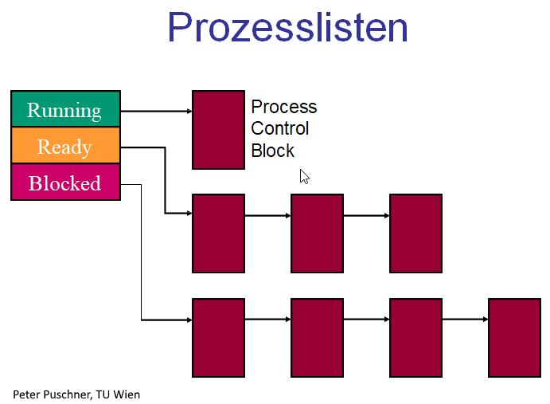
_Abbildung 5: Prozesszustände und Warteschlangen_

* bei Prozesswechsel müssen die Registerinhalte des vorherigen Prozesses auf dem Stack gesichert werden

## Prozessverwaltung
* **Prozessverwaltung**: Komponente eines Betriebssystems, die für die Zuteilung von Betriebsmitteln an wartende Prozesse zuständig ist
* alle für die Prozessverwaltung wichtigen Informationen sind im **Prozessleitblock** hinterlegt
* die Leitblöcke aller Prozesse sind in einer Systemprozesstabelle angegeben

### Steuerung von Prozessen
* Der **Scheduler** entscheidet nach einer Strategie, welcher Prozess wann und wie lange ausgeführt werden darf.
* verschiedene Strategien zur bestmöglichen Ausnutzung der CPU
* Ziele aller Strategien:
	* hohe Auslastung der CPU
	* hoher Durchsatz an Prozessen
	* größtmögliche Effektivität (geringste Gesamtwartezeit)
	* kurze Antwortzeiten

### Scheduling-Strategien
**2 Arten von Strategien**:
* **non-preemptive** (kooperative) Strategien: Prozess läuft so lange, bis er terminiert oder auf ein Ereignis wartet (_blocked_)
* **preemptive** (verdrängende) Strategien: aktiver Prozess kann vom Scheduler aus der CPU gezogen und wieder in die Warteschlange eingeordnet werden 

Moderne Betriebssysteme verwenden ausschließlich preemptive Strategien.

### Non-preemptive Scheduling-Strategien
* _First Come, First Serve_ (FCFS)
	* Prozesse werden in der Reihenfolge ihrer Initiierung in die Warteschlange geordnet, diese wird nach dem FIFO-Prinzip (_First In, First Out_) bearbeitet.
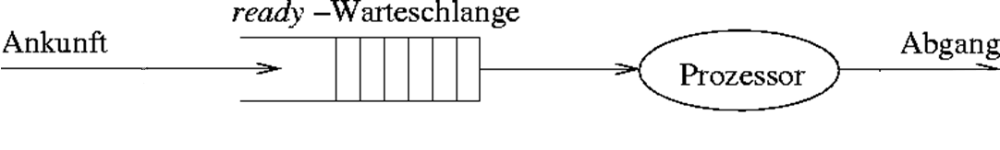
_Abbildung 6: Scheduling-Strategie "First Come, First Serve"_
* _Shortest Job First_ (SJF)
	* Prozesse mit geringsten Bedienzeiten werden zuerst behandelt.
	* Ziel: Durchschnittliche Antwortzeit reduzieren
	* Prozesse können bei hohen Prozess-Aufkommen "verhungern"
* _Highest Response Ratio Next_ (HRRN)
	* Bevorzugt Prozesse mit höheren Antworzeit / Bedienzeit Verhältnissen
* _Priority Scheduling_ (PS)
	* jeder Prozess $i$ hat eine Priorität $p$
	* Bereit-Warteschlange wird nach Priorität sortiert und nach FIFO-Prinzip bearbeitet.

### Preemptive Scheduling-Strategien
* _Round Robin_ (RR)
	* Zeitscheibenverfahren mit erhaltener Prozessreihenfolge durch FCFS
	* jeder Prozess ist für eine festgelegte Zeit $t_{\text{slice}}$ aktiv und wird danach wieder ans Ende der Warteschlange angehängt
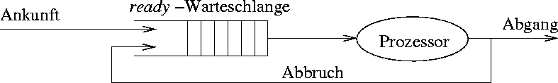
_Abbildung 7: Scheduling-Strategie "Round Robin"_
* _Dynamic Priority Round Robin_ (DPRR)
	* Round Robin mit priorisierter Warteschlange wie bei PS
	* Priorität wird bei jedem Durchgang erhöht
* _Shortest Remaining Time First_ (SRTF)
	* nach jeder Unterbrechung erhält der Prozess mit der niedrigsten verbleibenden Ausführungszeit die CPU
	* Problem: Restzeit ist oft schwer abzuschätzen

### Prozess-Scheduling in UNIX
* _Round Robin_ kombiniert mit dynamischen Prioritäten
* jede Priorität hat seine eigene Warteschlange und die höchsten Prioritäten werden zuerst bearbeitet

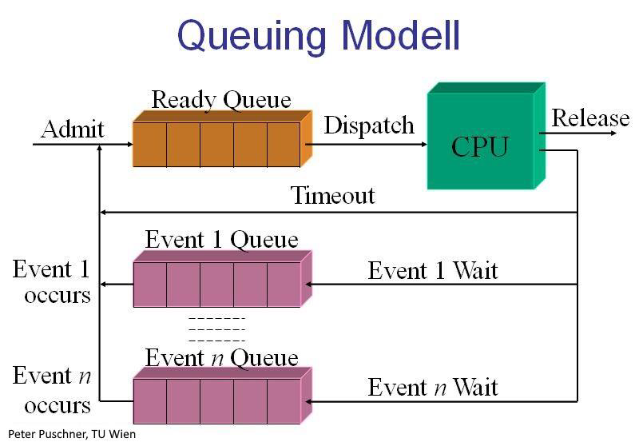
_Abbildung 8: Prozessplanung unter UNIX_

### Prozesshierarchie
* Ein Prozess kann einen neuen Prozess auslösen
	* Vater-Prozess (_parent process_) $\rightarrow$ Kind-Prozess (_child process_)
* Eltern- und Kindprozesse können miteinander kommunizieren
* Bei Abschluss des Elternprozesses werden üblicherweise alle Kindprozesse geschlossen

## Threads und Prozesse
* konventionelle Prozesse kombinieren Ressourcenverwaltung und internes Scheduling
* Entkopplung durch
	* Prozess $\rightarrow$ Ressourcenverwaltung, virtueller Adressraum
	* Thread $\rightarrow$ Zuweisung eines Kind-Prozesses zur CPU (_Dispatching_)
		* Ausführungszustand (_running_, _ready_, ...)
		* Kontext
		* Stack
		* eigenes Prozessverwaltungssystem innerhalb des Prozesses
* **Multithreading**: Innerhalb eines Prozesses werden mehrere Tätigkeiten parallel vorgenommen, setzt Fähigkeit des Betriebssystem zum Multithreading voraus.

## Kommunikation zwischen Prozessen
Prozesse müssen ständig miteinander kommunizieren, z.B. für den Aufbau von **Pipelines** (Übergabe der Ausgabe des vorherigen Prozesses an den nächsten Prozess).

### Möglichkeiten der Prozesskommunikation
* Nutzung eines gemeinsamen Speicherbereiches
* Kommunikation über Dateien im Dateisystem
* expliziter Austausch von Nachrichten
* Kommunikation über _Pipes_ (UNIX-spezifisch)

Eine sichere Prozesskommunikation bedarf einer geeigneten Prozesssynchronisation, um den gegenseitigen Ausschluss umzusetzen.

**Problem**: mehrere Prozesse greifen gleichzeitig auf eine gemeinsame Ressource zu (z.B. Speichervariable)

Code-Abschnitte, die nicht unterbrochen werden **dürfen**, weil sie bspw. eine Transaktion tätigen, bezeichnet man als **kritischen Abschnitt**. Daher dürfen sich mehrere Prozesse nicht gleichzeitig in ihren kritischen Abschnitten befinden.

### Bedingungen für den gegenseitigen Ausschluss (_mutual exclusion_)
1. Nur ein Prozess darf sich im kritischen Abschnitt befinden.
2. Prozesse, die in den kritischen Abschnitt eintreten oder diesen verlassen, müssen die anderen wartenden Prozesse über dieses Ereignis informieren.
3. Auch bei mehr als 2 Prozessen muss das Verfahren einwandfrei sein.
4. Jeder Prozess soll gleiche Chancen auf den Eintritt in einen kritischen Abschnitt haben.
5. Kein Prozess in einem kritischen Abschnitt darf andere blockieren.
6. Kein Prozess soll unendlich lange warten müssen.

### Unterbrechungssperre
**Idee**: Unterbrechungen (_Interrupts_) werden bei Ausführungen eines kritischen Abschnitts ignoriert / maskiert. Selbst das Betriebssystem kann den laufenden Prozess nicht anhalten.

| Vorteile | Nachteile |
|:---------|:----------|
| + einfache Realisierung | - Anwender muss Maskierung wieder aufheben (kann leicht vergessen werden) |
| | - hohe Reaktionszeit bei eintreffenden E/A-Unterbrechungsanforderungen können zu Datenverlust führen |
| | - funktioniert nicht bei Mehrprozessorbetrieb |

### Verwendung eines Semaphors
**Definition**: Ein Semaphor (DIJKSTRA, 1965) ist eine Variable $S$, auf der die zwei folgenden ununterbrechenbaren Operationen `P` (Passieren) und `V` (Verlassen) definiert sind:
```java
P(S) := [ while (S <= 0) { /* do nothing */ }; S = S - 1; ]
V(S) := [ S = S + 1; ]
```
Initialisierung mit `S = 1`.

**Implementation**:
```java
int S = 1; // Zahl der verfügbaren Betriebsmittel
P(S);
// kritischer Abschnitt hier
V(S);
```

**Nachteil**: rechenintensive Warteschleife in `P(S)` (_busy wait loop_)

**effizientere Implementation** mit `S` als Objekt mit den Attributen `ctr` (Wert des Semaphors) und `list` (Liste wartender Prozesse):
```java
P(S) := [ S.ctr = S.ctr – 1;
          if (S.ctr < 0) {
              put pid in S.list;
              sleep();
          } 
        ]
V(S) := [ S.ctr = S.ctr + 1;
          if (S.ctr <= 0) {
              get pid from S.list;
              wakeUp(pid);
          }
        ]
```
Systemaufruf `sleep()` blockiert Prozess `pid` und verbraucht so keine CPU-Zeit mehr, bis er durch `wakeUp(pid)` wieder reaktiviert wird.

### Erzeuger- / Verbraucher-Problem
* Erzeuger-Prozess (_producer_) erzeugt Daten und schreibt sie in einen Puffer mit `N` Speicherplätzen
* Verbraucher-Prozess (_consumer_) liest Daten aus Puffer mit unterschiedlicher Geschwindigkeit

**1. Idee**: Realisierung eines gegenseitigen Ausschlusses mit Semaphor `mutex = 1`
$\rightarrow$ unsicher, da Deadlocks auftreten können

**2. Idee**: Verwendung weiteres Semaphors für
1. die Anzahl belegter Speicherplätze `used`
2. die Anzahl freier Speicherplätze `free`

### Bewertung des Semaphor-Konzepts
| Vorteile | Nachteile |
|:---------|:----------|
| + mächtiges Konzept | - teils schwierige Suche nach korrekter Lösung |
| + flexibel | - Verklemmungen zwischen Prozessen ist möglich |
| + vielseitig | - unübersichtlich (`P` und `V` im Code verstreut) |
| + einfache Realisierung | - leichte Programmierfehler durch Vertauschungen |

* ein **Monitor** ist ein abstrakter Datentyp, mit dem eine Synchronisation von Prozessen auf höherer Ebene stattfinden kann

### Kommunikation mittels Nachrichten
**2 Kommunikationsroutinen**:
* `send(destination, message)`: Senden einer Nachricht `message` an den Empfänger `destination`
* `message = receive(source)`: Empfangen einer Nachricht vom Sender `source`

Empfänger-Prozess blockiert, falls er keine Nachricht empfängt, und wartet auf eine Nachricht. Sender und Empfänger können sich auf demselben Rechner oder auf getrennten Rechnern befinden.

Der Nachrichtenkanal wird als unsicher angesehen:
1. Empfänger bestätigt Empfang einer Nachricht.
2. Falls Sender nach einer vorgegebenen Zeitspanne keine Empfangsbestätigung erhält, wiederholt er das Senden der Nachricht.
3. Empfänger muss nun die wiederholte Nachricht empfangen, da auch die Bestätigung verlorengehen kann.

**Verschiedene Arbeitsweisen**:
* **synchrones** Senden einer Nachricht blockiert den Sender, bis eine Bestätigung eintrifft
* **asynchrones** Senden einer Nachricht blockiert den Sender nicht, d.h. Sender arbeitet normal weiter
	* Betriebssystem puffert gesendete Nachrichten, die noch nicht empfangen wurden

### Verklemmungen (_Deadlocks_)
* jede Situation, in der Prozesse **exklusiv** auf Ressourcen (Variablen) zugreifen, kann eine Verklemmung auslösen
* Für das Auftreten einer Verklemmung müssen 4 Bedingungen erfüllt sein:
	1. Exklusive Nutzung (_Mutual Exclusion_)
	2. Wartebedingung (_Hold & Wait_)
	3. Nichtentziehbarkeit (_Non-Preemption_)
	4. Geschlossene Kette (_Circular Wait_)

## Speicherverwaltung
### Zu bewältigende Aufgaben
* Bereitstellung von Adressräumen
* Verwaltung des Hauptspeichers als Betriebsmittel
* Schutz vor unerlaubten Zugriffen
* Organisation der Nutzung eines gemeinsamen Speicherbereiches

Die Speicherverwaltung ist die Komponente, die Prozessen einen Bereich im Hauptspeicher (**Kachel**) zuweist. Der Arbeitsspeicher eines Systems aus $S$ Worten wird eingeteilt in $\frac{S}{K}$ Seiten aus jeweils $K = 2\text{k}$ Worten (typisch 4 Kbyte). Das Betriebssystem wird beim Startvorgang durch das BIOS (_Basic Input Output System_) in die ersten Kacheln des Hauptspeichers geladen. Die Anwendungsprogramme finden in den übrigen Kacheln Platz.

### Speicherpartitionierung und Fragmentierung
Ein Anwendungsprogramm benötigt einen zusammenhängenden Speicherbereich (u.U. eine Partition benachbarter Seiten). Durch die Speicherverwaltung werden nur ganze Seiten vergeben, was zu **interner Fragmentierung** führen kann (siehe Abbildung 9).


_Abbildung 9: Beispiel einer internen Fragmentierung_

**2 Arten der Speicheraufteilung**:
* **feste Partitionen**: Speicher ist unterteilt in mehrere Partitionen fester Größe, jeder neue Prozess bekommt die kleinste ausreichende Partition zugewiesen
	* Problem: große Partitionen bleiben ungenutzt oder sind durch kleine Prozesse belegt
* **variable Partitionen**: dynamisch variierende Anzahl und Größe der Partitionen
	* Problem: Ersetzung von Partitionen lässt viele kleine freie Speicherbereiche entstehen ($\rightarrow$ **externe Fragmentierung**) und größere Prozesse können nicht mehr eingeordnet werden

### Prozesseinordnungsalgorithmen
**Ziel**: Minimierung des Verschnitts, damit nicht mehr so viele kleine freie Bereiche entstehen

Da die Suche nach einer freien Partition über die Belegungstabelle sehr aufwendig ist, bedient man sich einer verketteten **Freiliste**, die alle freien Partitionen beinhaltet und das Zusammenführen benachbarter freier Bereiche zulässt.

Folgende Algorithmen suchen nach dem geringstmöglichen Verschnitt:
* _First fit_
	* Durchsuchen der Freiliste von Anfang an
	* Auswahl des ersten gefundenen Bereichs, der groß genug ist
* _Best fit_
	* Durchsuchen der Freiliste von Anfang an
	* Auswahl des Bereichs mit der kleinsten ausreichenden Lücke
* _Buddy system_
	* dynamische Auswahl mithilfe mehrerer Freilisten abhängig von Seitengröße $2^k$ und Blockgröße $2^s$

### Swapping
Falls der Arbeitsspeicher als Einlagerungsressource für Prozesse nicht ausreicht, fängt das Betriebssystem an, ganze Prozesse auf die Festplatte auszulagern. Dies kostet viel Zeit und die Prozesse auf dem Massenspeicher verlangsamen sich bei einer Transferrate von $\le 10 \ \text{MB/s}$. Swapping ist sehr ineffizient, da immer ganze Prozesse aus- und eingelagert werden müssen. Außerdem bietet sich eine Speichergefährdung bei fehlerhafter Adressierung nach Relokation eines Prozesses, wodurch dieser die Daten anderer Prozesse manipulieren könnte.

### Der Adressraum
**Begriff**: Der Begriff **Adressraum** beschreibt die Menge an erreichbaren Adressen in einem bestimmten Speicher. Sie wird durch die Rechnerarchitektur vorgegeben.

**Physischer Adressraum**: ein durch Adressleitungen gebildeter Adressraum, referenziert den physikalischen Hauptspeicher, bildet die Prozessoradressen auf die Speicherbausteine und die E/A-Ports ab

**Virtueller (logischer) Adressraum**: Adressraum für Prozesse, Umrechung der virtuellen Adressen in physikalische Adressen durch _Memory Management Unit_ (MMU) (siehe Abbildung 10)


_Abbildung 10: Konvertierung einer virtuellen in eine physikalische Adresse_

### Virtueller Speicher
**Grundidee**: Zuordnung von Speicherobjekten (Prozessdaten) zu Regionen von Adressräumen (siehe Abbildung 11)

* strikte Trennung von virtuellem und physikalischem Speicher
* hardwarebasierte Abbildung von virtuellen auf physikalische Adressen
* virtueller Adressraum ist in **Seiten** (_pages_) und physikalischer Speicher in gleich große **Kacheln** (_frames_) aufgeteilt
	* Zuordnung von Seiten zu Kacheln durch **Seitenverzeichnis**
	* Seiten im virtuellen zusammenhängenden Adressraum werden auf **nicht zusammenhängende** Kacheln des physikalischen Speichers abgebildet
* **Seitenfehler** bei unberechtigtem Zugriff auf Kachel oder wenn Seite keine Kachel zugeordnet wurde
* jeder Prozess besitzt eine eigene **Seitentabelle**, die für jede Seite die Adresse der zugeordneten Kachel festhält

**Ziel**: jedem Prozess wird ein vom Hauptspeicher unabhängiger logischer Adressraum bereitgestellt

Betriebssystem kümmert sich um
* Seitenfehler
* Verwaltung des Hauptspeichers
* Aufbau der Adressraumstruktur
* Bereitstellung spezifischer Speicherobjekte


_Abbildung 11: Anordnung des virtuellen Speichers_

### Adressabbildung
* höherwertige Bits der virtuellen Adresse (rot) geben Seitennummer in Seitentabelle an
* niedrigwertigere Bits der virtuellen Adresse (grün) bilden den sogenannten _Offset_ (Wortadresse in Kachel) (siehe Abbildung 12)


_Abbildung 12: Kodierung der virtuellen Adresse_

* Präsenzbit $p$ gibt an, ob die Seite in den Hauptspeicher geladen wurde oder nicht.
* Seitentabelle kann noch Referenzbit $R$, Modifikationsbit $M$ (gibt an, ob die Seite im Hauptspeicher verändert wurde) und Zugriffsbits (Berechtigungen) enthalten

### Die Seitentabelle
Ein Seitentabelleneintrag kann folgendermaßen aussehen:


_Abbildung 13: Beispiel eines Seitentabelleneintrages_

**Seitentabellenattribute**:
* **present**: Seite befindet sich im Hauptspeicher
* **modified**: schreibender Zugriff ist erfolgt (_"dirty"_)
* **used**: irgendein Zugriff ist erfolgt
* **caching**: ein/aus (z.B. wegen E/A)
* **protection**: erlaubte Art von Zugriffen in Abhängigkeit von CPU-Modus

### Seitenwechselstrategien
**Einlagerungsstrategien**:
* _Pre-paging_
	* vorgeplante Einlagerung einer Seite, bevor sie von Programm adressiert wird
* _Demand-paging_
	* Seiten werden nur durch Unterbrechungen nach Seitenfehlern geladen

**Auslagerungsstrategien**:
* _Random_
	* Es wird eine zufällige Seite ausgelagert
* _First in, First out_ (FIFO)
	* Es wird stets die Seite, die als erstes hinzugefügt wurde, ausgelagert
* _Least Recently Used_ (LRU)
	* Es wird die Seite ausgelagert, die am längsten nicht mehr benutzt wurde (UNIX)
* _Least Frequently Used_ (LFU)
	* Es wird die Seite ausgelagert, die am seltensten benutzt wurde
* _Optimal Replacement_
	* Es wird die Seite ausgelagert, die am spätesten in der Zukunft wiederverwendet wird.

### Bewertung des virtuellen Speichers
| Vorteile | Nachteile |
|:---------|:----------|
| + geringe E/A-Belastung | - hoher Speicherbedarf für Seitentabellen |
| + automatischer Speicherschutz: jeder Prozess kann nur auf seine eigenen Seiten zugreifen | - hoher Implementierungsaufwand |
| + beliebig große Prozesse ausführbar | - hoher CPU-Bedarf für Seitenverwaltung, falls keine Hardware-Unterstützung |
| + keine externe Fragmentierung | |
| + dynamischer Speicherplatz | |

* Größe der Seitentabelle oder Geschwindigkeit der Abbildung können zum Problem werden

## Dateien und Dateisysteme
**Problem**: Größe vom Hauptspeicher ist begrenzt, Daten gehen verloren, sobald der Prozess beendet wird

**Lösung**: Sicherung der Daten auf dem permanenten Massenspeicher mit großer Kapazität

Betriebssystem muss bei Dateien auf dem Massenspeicher darauf achten, dass
* ein effizienter und schneller Zugriff gewährleistet ist und
* andere Benutzer nicht auf meine Dateien zugreifen können (Zugriffsberechtigungen).

### Massenspeicher / Hintergrundspeicher
* physikalisches Medium mit Blockstruktur
* 4 oder 8 Blöcke bilden ein Cluster (siehe Abbildung 14)

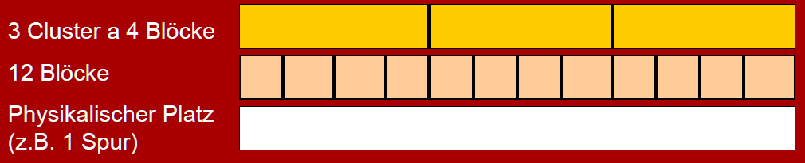
_Abbildung 14: Clustering des Hintergrundspeichers_

### Datei-Konzept
**Datei**: Eine mit Namen versehene Sammlung zusammengehöriger Informationen

* verschiedene Dateitypen (Textdatei, Quelltext, Bitmap, Binärdatei, Programmdatei, ...)
* Dateiattribute
	* Dateiname
	* Datei-Identifikator
	* Typinformationen, Format
	* Metadaten (Tabelle mit Informationen zur Datei)
* Datei-Operationen
	* Erzeugen
	* Schreiben
	* Lesen
	* Löschen
	* Umbenennen
	* Kopieren
	* Anhängen
* Operationen erfordern das Auffinden einer Datei in einem Verzeichnis (_Open File Table_ (OFT) enthält eine Liste aller offenen Dateien)
* Zugriffsarten
	* Sequenzieller Zugriff
	* Direkter Zugriff (_Direct Access_)

### Verzeichniskonzept
Alle Dateien in einem Dateisystem werden durch optionale Partitionen auf der Festplatte und durch Verzeichnisse organisiert (siehe Abbildung 15).


_Abbildung 15: Organisation von Dateien auf Festplatten_

Verzeichnisse bilden eine Struktur auf der Festplatte, unter der Dateien gespeichert werden können. In Verzeichnissen kann man
* nach einer Datei suchen
* eine Datei anlegen
* eine Datei löschen
* eine Datei umbenennen
* Dateien auflisten

### Verschiedene Varianten von Verzeichnissen
* **Single-Level-Verzeichnis**: Alle Dateien in einem Verzeichnis

_Abbildung 16: Single-Level-Verzeichnis_
* **Two-Level-Verzeichnis**: Struktur mit zwei Ebenen, wobei jeder Benutzer sein eigenes Verzeichnis hat
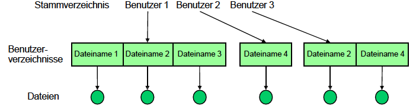
_Abbildung 17: Two-Level-Verzeichnis_
* **Baum-Verzeichnisstruktur**: Struktur mit Verzeichnissen und beliebig vielen Unterverzeichnissen, Datei wird über absoluten Pfad vom Wurzelverzeichnis (unter UNIX `/`) identifiziert

_Abbildung 18: Baum-Verzeichnisstruktur_

### Operationen auf Dateisystemen
* Dateien oder Verzeichnisse können über Links an mehreren Stellen referenziert werden ($\rightarrow$ azyklische Graphen / Referenzierung)
* andere Dateisysteme können in das Aktuelle an einen bestimmten Punkt eingehängt werden (_mount_)

### Implementierung auf Festplatten
* Dateien werden magnetisch gespeichert
* Festplatte besteht aus
	* Scheiben und Schreib- / Leseköpfen (beidseitig)
	* Scheiben bestehen aus Spuren (_Tracks_)
	* Spuren sind in Sektoren aufgeteilt (siehe Abbildung 19)
* Scheiben werden durch _spindle_ rotiert
* um den Durchsatz zu erhöhen, werden Daten blockweise übertragen (Block = mehrere Sektoren)
* Zugriffe werden durch Gerätecontroller (_disk controller_) gesteuert

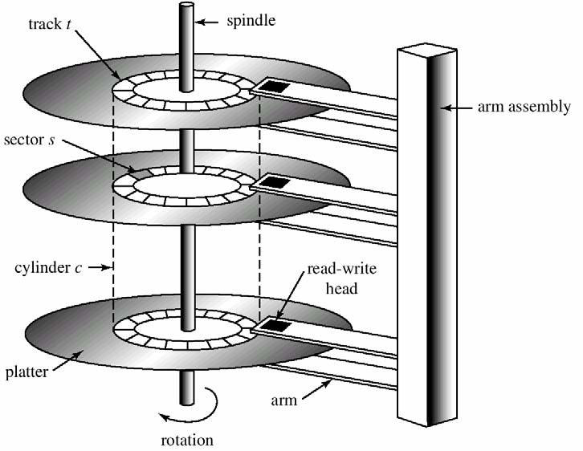
_Abbildung 19: Aufbau einer Festplatte_

### Implementierung von Dateisystemen
Dateisysteme sind in Schichten realisiert:
* **E/A-Kontrolle**: Treiber für Datenübertragung
* **Basic File System**: veranlasst Treiber, physikalische Blöcke auf Festplatte zu schreiben bzw. von dort zu lesen
* **Dateiorganisationsmodul**: Abbildung von logischen zu physikalischen Blockadressen
* **Logisches Dateisystem**: Neueintragung / Löschung von Dateien sowie E/A-Zugriffe auf eine Datei

| Schichten |
|:---------:|
| Anwendungsprogramme |
| logisches Dateisystem |
| Dateiorganisationsmodul |
| Basic-File-System |
| E/A-Kontrolle |
| Hardware |

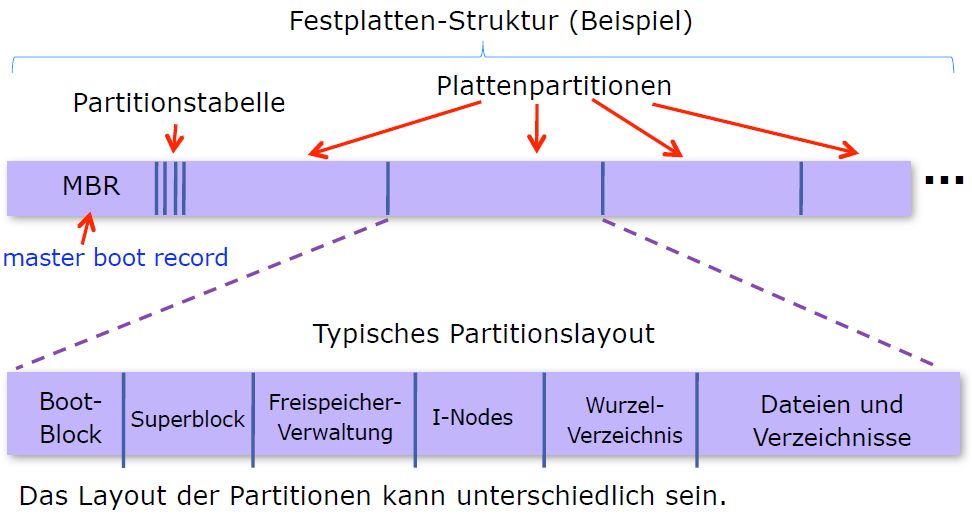
_Abbildung 20: Segmente einer Festplatte_

* _Master Boot Record_ (MBR) liegt immer im ersten Segment der Festplatte (Sektor 0)
	* enthält die Anfangs- und Endadressen jeder Partition
	* Beim Boot-Vorgang wird der MBR vom BIOS (_Basic Input Output System_) ausgeführt
* **Superblock** (oder _Volume Control Block_)
	* enthält wichtige Parameter des Dateisystems

### Allokationsstrategien vom Dateisystem
Ein Dateisystem kann zwischen verschiedenen Möglichkeiten wählen, Blöcke von Daten wie Dateien auf die Festplatte zu schreiben:
* zusammenhängende Belegung
* verkettete Belegung
* Belegung durch verkettete Listen mit einer Tabelle im Arbeitsspeicher ($\rightarrow$ **indizierte Allokation**)

#### Zusammenhängende Belegung
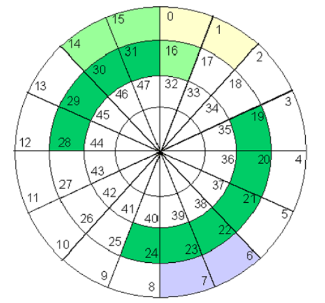
_Abbildung 21: Zusammenhängende Block-Allokation_
 
**Zugehörige Struktur des Verzeichnisses**
| Datei | Start | Länge |
|:-----:|:-----:|:-----:|
| Name1 | $0$ | $2$ |
| Name2 | $14$ | $3$ |
| Name3 | $19$ | $6$ |
| Name4 | $28$ | $4$ |
| Name6 | $6$ | $2$ |

#### Verkettete Belegung

_Abbildung 22: Verkettete Block-Allokation_

* Verzeichniseintrag enthält Zeiger auf den ersten und letzten Block der Datei und ihre Länge
* jeder Block hat einen Zeiger auf den nachfolgenden Block
* auch als doppelt verkettete Liste möglich (jeder Block hat einen Zeiger auf den vorherigen Block)

#### Indizierte Belegung
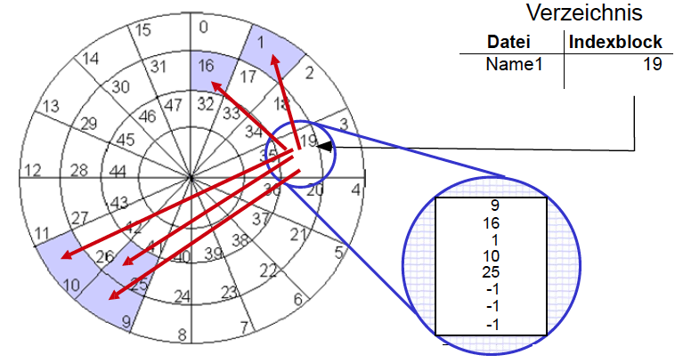
_Abbildung 23: Indizierte Block-Allokation_

* Tabelle im Arbeitsspeicher ($\rightarrow$ **Indexblock**) enthält alle Zeiger von Blöcken einer Datei
* Verzeichniseintrag enthält unter dem Dateinamen nur noch die Adresse des Indexblocks

#### Multi-Level-Indexblock
* Indexblock referenziert den nächsten Indexblock in einer Hierarchie
* Lösungen
	* _Linked Scheme_: Mehrere verkettete Indexblöcke
	* _Multi-Level Index_: Zweistufige Indexblocktabelle
	* _Combined scheme_: dynamische Anpassung der Indexblocktabelle für eine Datei abhängig von ihrer Größe


_Abbildung 24: Schema des Multi-Level-Indexblocks_

#### UNIX Inodes
Kombination aus
* indizierter Allokation und
* kaskadierten Indexblocktabellen


_Abbildung 25: UNIX Inodes_

| Vorteile | Nachteile |
|:---------|:----------|
| + schneller Zugriff für kleine Dateien | - maximale Dateigröße ist begrenzt |
| + keine externe Fragmentierung | - interne Fragmentierung |

## Ein- und Ausgabekonzepte und Bussysteme
Zur Realisierung einer geeigneten Ein- / Ausgabe benötigt man
* eine Strategie der Ein- / Ausgabe
* eine nach Möglichkeit standardisierte Schnittstelle (_interface_) zur Ein- / Ausgabe
* Ein- / Ausgabegeräte oder Peripheriegeräte

### Strategien der Ein- / Ausgabe
* Programmierte Ein- / Ausgabe: Programme legen explizit fest, wann eine Ein- oder Ausgabe erfolgt
* Unterbrechungen: bei Eintreffen neuer Daten kann ein Eingabebaustein eine Unterbrechung anfordern (_Interrupt Request_)
	* sobald möglich, bestätigt die CPU die Unterbrechung (_Interrupt Acknowledgment_) und startet eine Behandlungsroutine

### Kopplung der E/A-Bausteine
* Kopplung von CPU und E/A-Geräten erfolgt über spezielle E/A-Bausteine am Systembus

E/A-Bausteine haben folgende Register:
* **Kontrollregister**
	* Initialisierung und Parameterwahl durch CPU
* **Datenregister**
	* Zwischenspeicherung empfangener bzw. ausgegebener Daten
* **Statusregister**
	* Austausch von Statusinformationen zwischen E/A-Gerät und CPU

### Kommunikation zwischen CPU und E/A-Geräten
**2 Möglichkeiten der Datenübertragung**:
* speicherbezogene Adressierung über den Hauptspeicher (_Memory Mapped IO_)
* separater Adressraum für E/A-Bausteine (_Isolated IO_)

**3 verschiedene Übertragungsprotokolle**
* **Open-Loop Übertragung**
	* keine Rückmeldung bei der Datenannahme

_Abbildung 26: Open-Loop Datenübertragung_
* **Closed-Loop Übertragung** (auch _Handshaking_)
	* Bestätigung der Datenannahme über Steuersignal

_Abbildung 27: Closed-Loop Datenübertragung_
* **Fully-Interlocked Übertragung** (auch _Fully Interlocked Handshaking_)
	* Bestätigung der Datenannahme als auch aller Steuersignale

_Abbildung 28: Fully-Interlocked Datenübertragung_

### Direct Memory Access (DMA)
Um die CPU nicht mit trivialen Aufgaben wie der Weiterleitung von langen Datenströmen an Ausgabebausteine zu belasten, wird ein zusätzlicher DMA-Baustein benutzt, der nach einer Initialisierung durch die CPU den Speichertransfer eigenmächtig durchführt. Damit werden häufige Aufgaben wie das Inkrementieren von Adressen, Zählen von Datenwörtern oder Abfragen des Status der E/A-Bausteine ausgelagert.

Ein DMA-Baustein besteht aus folgenden Komponenten:
* ein Quelladress- und Zieladressregister
* ein Zählregister
* ein Kontrollregister für Statusinformationen

Ein System mit DMA-Baustein kann folgendermaßen aussehen


_Abbildung 29: Architektur eines Systems mit DMA-Baustein_

### Ablauf eines DMA-Transfers


_Abbildung 30: Ablauf eines DMA-Transfers_
`TransferRQ` = _Transfer Request_
`BRQ` = _Bus Request_
`BGT` = _Bus Grant_

### E/A-Scheduling-Strategien
* _First In, First Out_ (FIFO)
	* Bearbeitung der Auftragsliste nach Reihenfolge der Ankunft
	* d.h. Folge von Spurnummern:
	  $98, 183, 37, 122, 14, 124, 65, 67$
	* Gesamtzahl der Spurwechsel: $640$

_Abbildung 31: Spurenwechsel bei FIFO-Prinzip_
* _Shortest Seek Time First_ (SSTF)
	* Der Auftrag mit der niedrigsten Positionierungszeit wird bevorzugt
	* d.h. Folge von Spurnummern
	  $98, 183, 37, 122, 14, 124, 65, 67$
	* Gesamtzahl der Spurwechsel: $236$

_Abbildung 32: Spurenwechsel bei SSTF-Prinzip_
* _Elevator_ (SCAN)
	* Bewegung des Plattenarms in eine Richtung, bis keine Aufträge mehr vorhanden sind (**Fahrstuhlstrategie**)
	* d.h. Folge von Spurnummern:
	  $98, 183, 37, 122, 14, 124, 65, 67$
	* Gesamtzahl der Spurwechsel: $208$
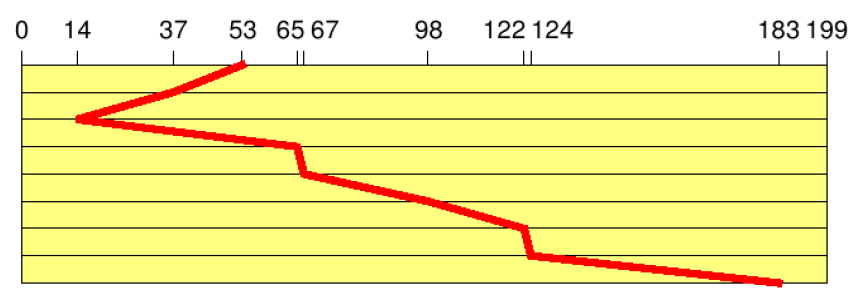
_Abbildung 33: Spurenwechsel bei Elevator-Prinzip_
* _Circular Scanning_ (C-SCAN)
	* funktioniert ähnlich wie _Elevator_
	1. arbeitet sich zum nächstgelegenen Ende der Platte vor
	2. springt ans andere Ende der Platte
	3. bearbeitet die nächstgelegenen Blöcke in der gleichen Richtung
	* Gesamtzahl der Spurwechsel: $187$

_Abbildung 34: Spurenwechsel bei C-SCAN-Prinzip_
* _Circular Looking_ (C-LOOK)
	* ähnlich wie _C-SCAN_
	* einziger Unterschied zu _C-SCAN_ ist, dass _C-LOOK_ nicht ganz bis ans Ende der Spur fortschreitet, sondern direkt vom letzten zum ersten Block am anderen Ende springt
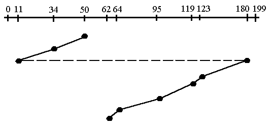
_Abbildung 35: Spurenwechsel bei C-LOOK-Prinzip_
