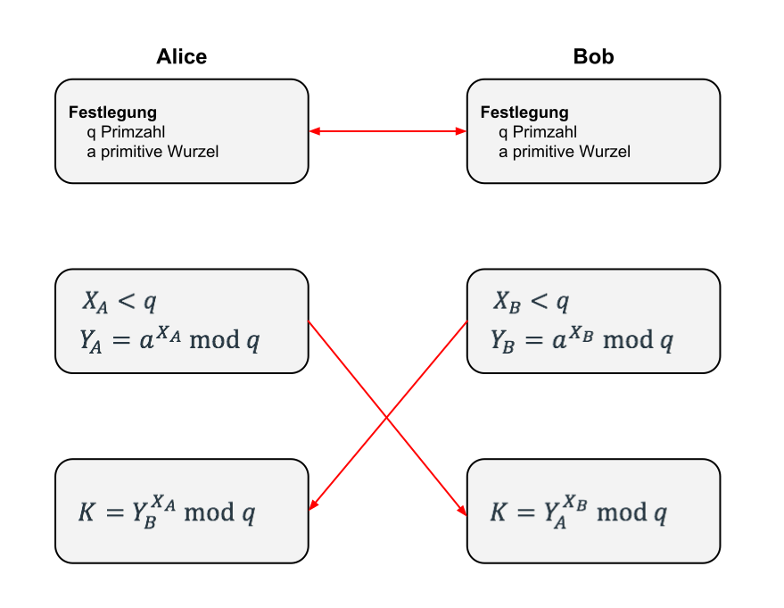

---
title: Kryptographie 14.03.2018
layout:_default
permalink: Semester_4/Kryptographie/2018-03-14_kryptographie_md
---

# Kryptosysteme für die digitale Signatur
_aus der Vorlesung Kryptographie vom 14.03.2018_

---

### ÜBUNG

Verschlüsseln Sie mit dem RSA-Algorithmus den Klartext $M = 10$ mit den Parametern $p = 29, q = 31$ und $e = 13$. Führen Sie auch eine artgerechte Entschlüsselung durch.

Berechnung des Totienten von $n$ und $d$:
$n = p \cdot q = 29 \cdot 31 = 899$
Totient: $\phi (n) = (p - 1)(q - 1) = 28 \cdot 30 = 840$
$e \cdot d \equiv 1 \mod{\phi (n)}$
$13 \cdot d \equiv 1 \mod{840}$
$d = 13^{-1} \mod{840}$

Berechnung des multiplikativen Inversen mit dem Erweiterten Euklidischen Algorithmus:
$a = 13, b = 840$

$x_1 \leftarrow 1 \quad \qquad y_1 \leftarrow 0$
$x_2 \leftarrow 0 \quad \qquad y_2 \leftarrow 1$
$x_3 \leftarrow 840 \qquad y_3 \leftarrow 13$

$Q = \lfloor \frac{x_3}{y_3} \rfloor = \lfloor \frac{840}{13} \rfloor = 64$

$T_1 \leftarrow x_1 - Q \cdot y_1 = 1$
$T_2 \leftarrow x_2 - Q \cdot y_2 = -64$
$T_3 \leftarrow x_3 - Q \cdot y_3 = 8$

$x_1 \leftarrow 0 \quad \qquad y_1 \leftarrow 1$
$x_2 \leftarrow 1 \quad \qquad y_2 \leftarrow -64$
$x_3 \leftarrow 13 \ \ \qquad y_3 \leftarrow 8$

$Q = \lfloor \frac{13}{8} \rfloor = 1$

$T_1 \leftarrow x_1 - Q \cdot y_1 = -1$
$T_2 \leftarrow x_2 - Q \cdot y_2 = 65$
$T_3 \leftarrow x_3 - Q \cdot y_3 = 5$

$x_1 \leftarrow 1 \ \quad \qquad y_1 \leftarrow -1$
$x_2 \leftarrow -64 \quad \quad y_2 \leftarrow 65$
$x_3 \leftarrow 8 \ \quad \qquad y_3 \leftarrow 5$

$Q = \lfloor \frac{8}{5} \rfloor = 1$

$T_1 \leftarrow x_1 - Q \cdot y_1 = 2$
$T_2 \leftarrow x_2 - Q \cdot y_2 = -129$
$T_3 \leftarrow x_3 - Q \cdot y_3 = 3$

$x_1 \leftarrow -1 \quad \quad y_1 \leftarrow -2$
$x_2 \leftarrow 65 \ \quad \quad y_2 \leftarrow -129$
$x_3 \leftarrow 5 \ \ \ \quad \quad y_3 \leftarrow 3$

$Q = \lfloor \frac{5}{3} \rfloor = 1$

$T_1 \leftarrow x_1 - Q \cdot y_1 = -3$
$T_2 \leftarrow x_2 - Q \cdot y_2 = 194$
$T_3 \leftarrow x_3 - Q \cdot y_3 = 2$

$x_1 \leftarrow 2 \ \ \ \qquad y_1 \leftarrow -3$
$x_2 \leftarrow -129 \quad y_2 \leftarrow 194$
$x_3 \leftarrow 3 \ \ \ \qquad y_3 \leftarrow 2$

$Q = \lfloor \frac{3}{2} \rfloor = 1$

$T_1 \leftarrow x_1 - Q \cdot y_1 = 1$
$T_2 \leftarrow x_2 - Q \cdot y_2 = -323$
$T_3 \leftarrow x_3 - Q \cdot y_3 = 1$

$x_1 \leftarrow -3 \ \ \quad y_1 \leftarrow 1$
$x_2 \leftarrow 194 \ \quad y_2 \leftarrow -323$
$x_3 \leftarrow 2 \ \qquad y_3 \leftarrow 1$

`STOP`: $y_3 = 1$
$d \equiv -323 \mod{840}$
$\ \ \ \equiv 517 \mod{840}$

**Check**: $13 \cdot 517 = 6721$
$\qquad \qquad \qquad \ = 8 \cdot 840 + 1$
$\qquad \qquad \qquad \ \equiv 1 \mod{840}$ ✅

$K_{\text{pub}} = (e, n) = (13, 899)$
$K_{\text{priv}} = (d, n) = (517, 899)$

**Verschlüsselung**:
$$
C^d \mod{n} = 640^{517} \mod{840}
$$

$M = 10, n = 899:$
$C = 10^{13} \mod{899}$
$\ \ \ \ = [(10^8 \mod{899}) (10^4 \mod{899}) (10 \mod{899})] \mod{899}$
$\ \ \ \ = (634 \cdot 111 \cdot 10) \mod{899}$
$\ \ \ \ = \underline{722}$

**Entschlüsselung**:
$$
\text{Klartext} = 722^{517} \mod{899}
$$

Berechnung der Potenz mit dem $\text{fastexp}$ Algorithmus:
$722^2 \mod{899} = 763$
$722^4 \mod{899} = 763^2 \mod{899} = 516$
$722^8 \mod{899} = 516^2 \mod{899} = 152$
$722^{16} \mod{899} = 152^2 \mod{899} = 629$
$722^{32} \mod{899} = 629^2 \mod{899} = 81$
$722^{64} \mod{899} = 81^2 \mod{899} = 268$
$722^{128} \mod{899} = 268^2 \mod{899} = 803$
$722^{256} \mod{899} = 803^2 \mod{899} = 226$
$722^{512} \mod{899} = 226^2 \mod{899} = 732$

$\text{Klartext}  = 722^{517} \mod{899}$
$\qquad \qquad = [(722^{512} \mod{899}) (722^4 \mod{899})$
$\qquad \qquad \quad (722 \mod{899})] \mod{899}$
$\qquad \qquad  = (732 \cdot 516 \cdot 722) \mod{899}$
$\qquad \qquad  = \underline{10}$

## Das DIFFIE-HELLMAN Key-Exchange Verfahren
Dieses Verfahren wurde in der Arbeit "_New Directions in Cryptography_" vorgestellt und zählt zu den Public-Key Verfahren, erlaubt aber
* keine Verschlüsselung
* keine digitale Signatur

Generell nutzen Public-Key Verfahren immer sogenannte **Trapdoor-Funktionen**; das sind Funktionen, die in der einen Richtung einfach sind, die Umkehrung jedoch schwierig bis unmöglich.

RSA: $p \cdot q \xrightleftharpoons[\text{schwierig}]{\text{einfach}} n = p \cdot q$

Eine andere Trapdoor-Funktion ist z.B.
$\rightarrow$ Berechne $\displaystyle \prod_{i = 1}^{11} \; (x - i ) = (x - 1) (x - 2) (x - 3) \ldots (x - 11)$
$\quad \qquad \qquad \qquad \qquad \ \ \, = x^{11} - 66x^{10} + 1925x^9 - 32670x^8$
$\quad \qquad \qquad \qquad \qquad \ \ \, \quad + 35742x^7 - 39916800x^6$

Das DH-Key-Exchange-Verfahren nutzt den **diskreten Logarithmus** als Trapdoor-Funktion; d.h. die Sicherheit des DH-Verfahrens hängt davon ab, dass es **sehr** schwierig (bis unmöglich) ist, diskrete Logarithmen zu berechnen.

Betrachte wieder die Menge $\mathbb{Z}_p = \{ 0, 1, \ldots, p - 1 \}$. Eine **primitive Wurzel** einer Primzahl $p$ ist eine Zahl in $\mathbb{Z}_p \backslash \{ 0 \}$, deren Potenzen alle Zahlen von $1$ bis $p - 1$ generiert. Ist $a$ eine primitive Wurzel, dann sind

$$
a \mod{p}, a^2 \mod{p}, a^3 \mod{p}, \ldots, a^{p - 1} \mod{p}
$$

alle unterschiedlich und bestehen aus den Zahlen $1$ bis $p - 1$ in irgendeiner (wilden!) Reihenfolge.

Beispiel: $p = 7, a = 3$
$3^1 \mod{7} = 3$
$3^2 \mod{7} = 2$
$3^3 \mod{7} = 6$
$3^4 \mod{7} = 4$
$3^5 \mod{7} = 5$
$3^6 \mod{7} = 1$

$p = 7 \Rightarrow 1, 2, 3, 4, 5, 6 = \mathbb{Z}_p \backslash \{ 0 \}.$

Das diskrete Logarithmusproblem lautet:
Finde $i$ mit
$$
b = a^i \mod{p} \qquad 0 \le i \le p - 1
$$

$i$ heißt diskreter Logarithmus oder **Index** von $b$ für die Basis $a \mod{b}$:
$$
i = \text{ind}_{a, p} (b)
$$

## Das DH-Key-Exchange Kryptosystem
1. **Szenario**: Alice und Bob wollen einen gemeinsamen Schlüssel erzeugen, den nur sie kennen, ohne sich zuvor begegnet zu sein.
2. Alice und Bob einigen sich (öffentlich) auf eine Primzahl $q$ und eine primitive Wurzel $a$ ($(q, a)$ ist eine Art Public Key).
3. **Geheimer Schlüssel Alice**
Alice wählt eine Zahl $X_A$ ($X_A < q$) und wird Alice benannt. Alice berechnet
$$
Y_A = a^{X_A} \mod{q}
$$
$Y_A$ geht an Bob.
4. **Geheimer Schlüssel Bob**
Bob wählt eine Zahl $X_B$ ($X_B < q$) und wird Bob benannt. Bob berechnet
$$
Y_B = a^{X_B} \mod{q}
$$
$Y_B$ geht an Alice.
5. Alice berechnet $K = (Y_B)^{X_A} \mod{q}$.
6. Bob berechnet $K' = (Y_A)^{X_B} \mod{q}$.

$\rightarrow$ Da $K = K'$ (gleich), haben Bob und Alice einen gemeinsamen Sitzungsschlüssel.

Es gilt:
$K = Y_B^{X_A} \mod{q}$ (Alice)
$\quad \, = (a^{X_B} \mod{q})^{X_A} \mod{q}$
$\quad \, = (a^{X_B})^{X_A} \mod{q}$
$\quad \, = a^{X_B \cdot X_A} \mod{q}$
$\quad \, = (a^{X_A})^{X_B} \mod{q}$
$\quad \, = Y_A^{X_B} \mod{q} = K'$ **von Bob**

Also öffentlich: $q, a, Y_A, Y_B$

Ein Angreifer, der den Schlüssel $K$ erhalten will, muss $X_A$ oder $X_B$ berechnen aus

$\qquad \qquad Y_A = a^{X_A} \mod{q}$
$\text{oder} \qquad \, Y_B = a^{X_B} \mod{q}$
$\text{oder} \quad \quad X_B = \text{ind}_{a, q} (Y_B).$

Das DH-Verfahren macht nur Sinn, wenn beide Parteien _online_ sind, denn Alice und Bob müssen eine Reihe von Informationen austauschen ($q, a, Y_A, Y_B$), damit besser kommuniziert wird.

Beispiel: Alice und Bob einigen sich auf
$$
q = 479, a = 11.
$$

Alice wählt $X_A = 102 \quad \text{mit} \; 1 \le X_A \le 478$
Bob wählt $\; X_B = 110 \quad \text{mit} \; 1 \le X_B \le 478$

Alice berechnet $Y_A = a^{X_A} \mod{q}$
$\qquad \qquad \qquad \quad \, \,  = 11^{102} \mod{479}$
$\text{fastexp} \rightarrow \quad \quad \ \ \ \, = \underline{218}$

$Y_A = 218$ wird an Bob gesendet.

Bob berechnet $Y_B = a^{X_B} \mod{q}$
$\qquad \qquad \qquad \quad = 11^{110} \mod{479}$
$\text{fastexp} \rightarrow \quad \quad \, \, \; = \underline{42}$

$Y_B = 42$ wird an Alice gesendet.

Dann berechnet Alice $K = Y_B^{X_A} \mod{q}$
$\qquad \qquad \qquad \qquad \quad \ = 42^{102} \mod{479}$
$\text{fastexp} \rightarrow \qquad \qquad \; \; \; = \underline{242}$

Bob berechnet $K' = Y_A^{X_B} \mod{q}$
$\qquad \qquad \qquad \quad = 218^{110} \mod{479}$
$\text{fastexp} \rightarrow \qquad \; \; = \underline{242}$

Daher ist der Sitzungsschlüssel $K = 242$.

## ELGAMAL-Kryptosysteme (TAHER ELGAMAL, 1985)

### Digitale Signatur
**Schlüssel**: Wähle eine Primzahl $p$ mit zwei Zufallszahlen $g, x$ mit $g, x < p$.
Berechne $y = g^x \mod{p}$

$K_{\text{pub}} = [y, g, p]$
$K_{\text{priv}} = [x]$

**Signatur**: $M$ soll signiert werden.
Wähle eine zufällige Zahl $k$, so dass $k$ und $p - 1$ coprim sind, d.h.
$$
\text{ggT}(k, p - 1) = 1.
$$

Berechne
$$
a = g^k \mod{p}.
$$

Berechne $b$ aus
$$
M \equiv (xa + kb) \mod{(p - 1)}
$$

Signatur: $(a, b)$, $k$ bleibt geheim.

Bob verifiziert die Signatur wie folgt:
Es muss gelten:
$$
y^a \cdot a^b \mod{p} \overset{!}{=} g^M \mod{p}
$$

Beispiel:
1. $p = 13, g = 7$ öffentliche Zahlen
2. Alice wählt als geheimen $K_{\text{priv}} \rightarrow x = 3$
3. $y = g^x \mod{p} = 7^3 \mod{13} = 5$
$K_{\overset{A}{\text{pub}}} = [p, g, y] = [13, 7, 5]$
$K_{\overset{A}{\text{priv}}} = [x] = [3]$

Klartext, der von Alice signiert wird, ist $M = 10$.
Zum Signieren muss Alice die Zahlen $a, b$ bestimmen:

4. Alice wählt zufällige Zahl $k = 5$, ist ok: $\text{ggT}(5, 12) = 1$
5. $a = g^k \mod{p}$
$\ \ \ = 7^5 \mod{13} \equiv 11 \mod{13}$
6. Berechne $b$ aus
$M = (xa + kb) \mod{(p - 1)}$
$10 = (3 \cdot 11 + 5 \cdot b) \mod{12}$
$\quad \ = (9 + 5 \cdot b) \mod{12}$
$\iff 1 \equiv 5 \cdot b \mod{12}$
$\qquad \rightarrow \underline{b = 5}$

An Bob wird gesendet:
* Klartext $M$
* Signaturwerte $[a, b] = [11, 5]$
* $K_{\text{pub}}$ von Alice: $K_{\overset{A}{\text{pub}}} = [p = 13, g = 7, y = 5]$

**Verifikation**:
$\qquad \qquad (y^a \cdot a^b) \mod{p} \overset{!}{=} g^M \mod{p}$
$\text{links:} \quad \ \ \, (5^{11} \cdot 11^5) \mod{13} = 4 \mod{13}$
$\text{rechts:} \quad \ 7^{10} \mod{13} = 4 \mod{13}$
$\Rightarrow$ Beide Terme sind gleich.
