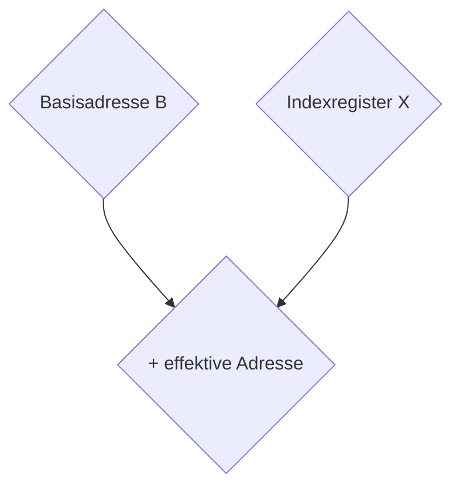

---
title: Rechnertechnik 13.03.2018
layout: default
permalink: Semester_4/Rechnertechnik/2018-03-13_rechnertechnik_md
---

# Gleitpunktarithmetik und Maschinenbefehle
_aus der Vorlesung Rechnertechnik vom 13.03.2018_

---

_Beispiel_:
| **Dual** | **Oktal** | **Dezimal** | **Hex** | ($126_d + 35_d = 161_d$) |
|--:|:--:|:---:|:---:|:---:|
| $0111110$ | $176$ | $126$ | $7E$ | Summand 1 | 
| $+ 100011$ | $+ 43$ | $+ 35$ | $+ 23$ | Summand 2 |
| $11111100 \leftarrow$ | $110 \leftarrow$ | $010 \leftarrow$ | $0 \leftarrow$ | Übertrag (Carry) |
| $10100001$ | $241$ | $161$ | $A1$ | Summe |

_Beispiel 2_:
| **Dual** | **Oktal** | **Dezimal** | **Hex** | ($130_d - 42_d = 88_d$) |
|--:|:--:|:---:|:---:|:---:|
| $10000010$ | $202$ | $130$ | $82$ | Minuend | 
| $- 101010$ | $- 52$ | $- 42$ | $- 2A$ | Subtrahend |
| $11110000 \leftarrow$ | $100 \leftarrow$ | $110 \leftarrow$ | $10 \leftarrow$ | Borger (Borrow) |
| $01011000$ | $130$ | $088$ | $58$ | Differenz |

**Analogie beider Multiplikationsverfahren**:
* Dezimal: $5 \cdot 6 = 30$
* Dual:
```
101 * 110
---------
  101
   101
    000
--------- / 
  11110 \/
```
* Dezimal:
```
26 * 242
--------
  52
  104
    52
--------
  6292
```
* Hex:
```
1A * F2
-------
 186
   34
-------
 1894
```
Nebenrechnungen:
$F \cdot A = 9\underline{6}, \quad 1 \cdot F + 9 = \underline{18}$
$2 \cdot A = 1\underline{4}, \quad 2 \cdot 1 + 1 = \underline{3}$

Aus einer Vielzahl möglicher Zahlendarstellungen werden aus ökonomischen Gründen in Rechnern in der Regel nur wenige realisiert.
Üblich sind:
* Duale Festpunktzahlen
* Dezimale Festpunktzahlen
* Gleitpunktzahlen

Duale Festpunktzahlen sind ganzzahlig; sie werden eingesetzt, wenn sicher vorhergesagt werden kann, dass sich die zu berechnenden Ergebniswerte im Bereich der darstellbaren Festpunktzahlen bewegen. Darstellungseinheiten für Festpunktzahlen sind Maschinenwörter von $8$, $16$, $32$ oder $64$ Bit Länge.

Es gelten hierbei folgende Vorschriften:
* die linke Bitstelle ist das Vorzeichen mit der Zuordnung $0$ für $+$ und $1$ für $-$.
* die restlichen Bitstellen kodieren den ganzzahligen Absolutwert der Zahl.

Negative Zahlen werden als Zweierkomplement dargestellt. Für eine $n$-stellige Zahl $x$ entsteht das Zweierkomplement durch $2^n - |x|$; d.h. es wird immer zu $2^n$ ergänzt.

Beispiel: $n = 8:$
| **Dezimal** | **Dual** |
|-----:|-------:|
| $2^8 = 256$ | $1\,0000\,0000$ | 
| $-27$ | $- 1\,1011$ |
| Zweierkomplement von 27 $\rightarrow 229$ | $(0)\,1110\,0101$ 

Das Zweierkomplement kann auch einfacher berechnet werden:
1. Invertiere alle Bits
2. Addiere eine $1$

Beispiel: $095_d - 27_d = 086_d$

```
           invertiere     
  0101 1111 bitweise      addiere 1 
- 0001 1011 ----> 1110 0100 -----> 1110 0100
                                           1
                                   ---------
                                   1110 0101
```
$\underbrace{--------------------}$
|  |  |
|--:|--:|
|   | $01011111$ |  |
| - | $11100101$
| 1 | $111111$
| $(1)$ | $01000000$

Übung: Berechne Zweierkomplement von $x = 15212_d$ nach der Methode $2^n - |x|$ mit $n = 16$.

Für die Darstellung alphanumerischer Zeichen, d.h. Alphabet mit Groß- und Kleinbuchstaben, Satz- und Sonderzeichen reichen $6$ Bit für 64 Zeichen. Die weitverbreitesten Codes zur Zeichendarstellung verwenden $8$ Bits, wobei der Zeichensatz um Steuerzeichen für externe Geräte wie Drucker oder Bildschirm sowie zur Datenübertragung erweitert ist.

Die Darstellung von Gleitpunktzahlen ist technisch aufwendiger, sie gestaltet aber die Abdeckung von großen Wertebereichen mit befriedigender Genauigkeit.

Die Abschätzung von Ergebnisdaten muss nur grob erfolgen, da es meist nur Gleitpunktdarstellungen mit einfacher, doppelter oder vierfacher Genauigkeit gibt. Grundlage der Gleitpunktdarstellung einer rellen Zahl $x$ ist die Form:

$$
x = m \cdot b^e \quad \text{mit} b \in \{2, 8, 16\} \text{und} e \in \mathbb{Z} \text{und} -1 < m < +1.
$$

Der Dezimalpunkt ist bei der Mantisse linksbündig. Ist die erste Ziffer der Mantisse hinter dem Dezimalpunkt ungleich $0$ ($\neq 0$), so bezeichnet man die Darstellung als **normalisiert**. Dann ist:

$$
0.1 < m < 1 \quad \text{oder} \quad m = 0.
$$

Für den Exponenten $e$ genügt ein kleiner Wertebereich, z.B.

$$
-50 < e < +50, \quad e \in \mathbb{Z} \quad \text{bei} \quad b = 10,
$$

um Bereiche vom mikroskopisch Kleinen bis astronomisch Großem abzudecken.

Rechnerintern wird das Vorzeichen des Exponenten meist durch eine virtuelle Verschiebung umgangen.

Der EBCDIC-Code (**E**xtended **B**inary-**C**oded **D**ecimal **I**nterchange **C**ode) wurde von IBM für Großrechner entwickelt, dabei sind für die Dezimalzahlen alle Bits des zweiten Nibbles gleich $1$.

| **2. Nibble** | **1. Nibble** | **Zeichen** | **Zahl** |
|:--:|:--:|:---:|:---:|
| $1111$  | $0000$  | $0$ | $0$ |
| $\vdots$ | $0001$ | $1$ | |
|$\vdots$ | $0010$ | $2$ |  |
|$\vdots$ | $0011$ | $3$ | |
|$\vdots$ | $0100$ | $4$ | |
|$\vdots$ | $0101$ | $5$ | |
|$\vdots$ | $0110$ | $6$ | |
|$\vdots$ | $0111$ | $7$ | |
| $\vdots$ | $1000$ | $8$ | |
| $1111$ | $1001$ | $9$ | |

Der EBCDIC-Code vereinfacht die Konvertierung von Zeichen zu Zahlen und umgekehrt.

Der zweite wichtige Zeichencode ist der ASCII-Code (**A**merican **S**tandard **C**ode **I**nformation **I**nterchange). Hier sind $7$ Bit für die Unterscheidung von 128 Zeichen belegt. Das achte Bit wird als Prüfbit zur Fehlererkennung bei der Übertragung von Zeichen verwendet.

## Maschinenbefehle
Ein Maschinenbefehl "befiehlt" eine Operation an spezifizierten Daten, nämlich den sogenannten **Operanden**. Im Rechner wird ein Befehl in einem Befehlswort kodiert. Ein Befehlswort besteht aus einem Operationsteil und in der Regel aus einem oder mehreren Adressteilen. Bei den meisten Rechnerarchitekturen ist die Länge der Befehlsworte, z.B. wegen unterschiedlicher Anzahl von Adressteilen, unterschiedlich. Üblich sind 1-, 2-, 4- und 6-Byte lange Befehlsworte.

Die wichtigsten Operationsarten des binär kodierten Operationsteils sind:
* arithmetische Operationen: Addition, Multiplikation, Inkrement, Dekrement
* logische Operationen: `AND`, `OR`, `XOR`, `NOT`
* Schiebeoperationen
* Transportoperationen zwischen Registern und Arbeitsspeichern
* I/O - Operationen
* Programmablaufoperationen: Sprünge, Unterbrechungsoperationen (Interrupts)

Neben der Art der Operation verschlüsselt der Operationsteil auch die Länge des Befehls, die Art und Anzahl der Operanden und die Adressierungsart der Operanden. Bei einigen Befehlen wird kein Operand benötigt oder der Operand ist durch den Operationsteil implizit bestimmt, z.B. das Program-Counter-Register beim Rücksprung aus einem Unterprogramm.

Im Adressteil des Befehls wird angegeben, wo sich ein Operand befindet. Grundsätzlich gibt es hierfür zwei Möglichkeiten:
* der Operand befindet sich im Arbeitsspeicher
* der Operand befindet sich in einem Register der CPU
* der Operand befindet sich in einem prozessornahen Cache. Dieser kann vom Benutzer nicht adressiert werden und dient dazu, den "Von-Neumann-Flaschenhals" zu öffnen.

Moderne Prozessoren verfügen über verschiedene Adressierungsarten. Neben direkter Adressangabe gibt es indirekte Verfahren, bei denen die eigentlichen Operanden in dem adressierten Register oder Speicherwort steht. Durch indirekte Adressierung ist es möglich, die Adresse des Operanden zur Laufzeit des Programms zu berechnen. Die indirekte Adressierung ist sehr flexibel, hat jedoch den Nachteil, dass der doppelte Zugriff auf Register oder Arbeitsspeicher die Zeit für Ausführung des Befehls verlängert.

Eine weitere wichtige Adressierungsart ist die **Indizierung**. Sie wird hauptsächlich beim Zugriff des Programms auf Datenfelder verwendet. Die Daten werden über ein Indexberechnungsverfahren aus dem Arbeitsspeicher abgegriffen. Dabei wird der Inhalt eines speziellen Registers, des **Indexregisters**, verändert (_engl. manipuliert_) und auf eine Adresse (Basisadresse eines Datenobjekts), die meist auch in einem Register gehalten wird, aufaddiert, um die effektive (letztendlich) Speicherplatzadresse zu berechnen.

Mit Indizierung kann eine Sequenz von Befehlen auf verschiedene Daten iterativ angewendet werden.

Eine typische Sequenz ist die Addition von Feldelementen.

Beispiel: Addition von $10$ Feldelementen
`Programmausschnitt`
```batch
       SET X = 0
 LOOP: ADD R = R + (B + X)
       INC X
       JUMP to LOOP if x < 10
```



## Ausführungsphasen eines Maschinenbefehls
Nach dem bisherigen Überlegungen kann die Ausführung eines Maschinenbefehls in folgende Zeitphasen unterteilt werden.

* `F`: (Fetch) Befehlswort aus dem Speicher in das Befehlsregister laden.
* `D`: (Decode) Befehl dekodieren.
* `X` (Execute) Befehl ausführen (ggf. vorher Operanden aus dem Arbeitsspeicher in allgemeine Register laden).
* `S`: (Store) Resultate / Ergebnisse speichern.

Im Einzelnen sind innerhalb dieser Phasen folgende Schritte in der Ablaufsteuerung notwendig:

`F`: Befehlszähler in Adressregister übertragen, um den nächsten Befehl aus dem Speicher zu lesen.
`F`: Befehlszähler inkrementieren
`F`: Befehl in Befehlsregister laden
`D`: Befehl dekodieren zur Ausführung durch den Datenprozessor
`X`: Operandenadressen aus Befehlsregister in Adressregister übertragen und Operanden in allgemeine Register laden.
`X`: Berechnungen mit den Operanden durchführen
`S`: Ergebnisse speichern.
