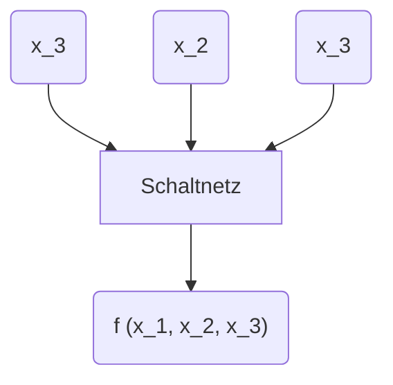

# Ausführungsphasen eines Maschinenbefehls
_aus der Vorlesung Rechnertechnik vom 15.03.2018_

---

Nach den bisherigen Überlegungen kann die Ausführung eines Maschinenbefehls in folgende Zeitphasen unterteilt werden.

*   `F`: (Fetch) Befehlswort aus dem Speicher (RAM) in das Befehlsregister (_Instruction Register_) laden.
*   `D`: (Decode) Befehl dekodieren.
*   `X`  (Execute) Befehl ausführen (ggf. vorher Operanden aus dem Arbeitsspeicher in allgemeine Register laden).
*   `S`: (Store) Resultate / Ergebnisse speichern.

Im Einzelnen sind innerhalb dieser Phasen folgende Schritte in der Ablaufsteuerung notwendig:

`F`: Befehlszähler in Adressregister übertragen, um den nächsten Befehl aus dem Speicher zu lesen.  
`F`: Befehlszähler inkrementieren  
`F`: Befehl in Befehlsregister laden  
`D`: Befehl dekodieren zur Ausführung durch den Datenprozessor  
`X`: Operandenadressen aus Befehlsregister in Adressregister übertragen und Operanden in allgemeine Register laden.  
`X`: Berechnungen mit den Operanden durchführen  
`S`: Ergebnisse speichern.

Bei einem Sprungbefehl entfällt die `S`-Phase. Die `X`-Phase (Ausführungsphase) sieht bei einem bedingten Sprungbefehl wie folgt aus:
`X`: Überprüfung der Sprungbedingung
`X`: Bei Erfüllen der Bedingung $\rightarrow$ Übertragung der Sprungadresse vom Befehlsregister in den Befehlszähler

Bei einem unbedingten Sprungbefehl reduziert sich die `X`-Phase zu:
`X`: Übertragen der Sprungadresse aus Befehlsregister in den Befehlszähler

---

_Minimale Erweiterung der von-Neumann Architektur_:

Um in einen Rechner die Anzahl der ausführbaren Maschinenbefehle pro Zeit zu erhöhen, hat man neben schaltungstechnischen Maßnahmen auch früh schon architektonische Erweiterungen der von-Neumann Architektur vorgenommen.

Ein bis heute verwendetes Prinzip ist das **Befehls-Pipelining**, das durch die verschiedenen Phasen in die Befehlsausführung möglich ist. Die Idee dahinter ist, die Hardware-Komponenten, die zur Ausführung in den einzelnen Phasen benötigt werden, so weit zu entkoppeln, dass diese parallel betrieben werden können. $\rightarrow$ Dann muss nicht bis zum Ende der Ausführung eines Maschinenbefehls gewartet werden, bis die Ausführung des nächsten Befehls beginnen kann.

anschaulich:
```
             F-Phase     D-Phase     X-Phase     S-Phase     
Befehl 1  |-----------|-----------|-----------|-----------|  F-Phase     D-Phase
Befehlsausführung                                         |-----------|-----------| ...
ohne Pipelining
```

Mit Befehlspipelining kann der zweite Befehl bereits in der `D`-Phase des ersten Befehls geholt werden. Der einzelne Befehl wird dadurch schneller abgearbeitet, aber es werden nach einer Anlaufzeit (_Pipeline Startup Time_) mehr Befehle pro Zeit fertiggestellt.

anschaulich:
```
                             F1-Phase    D1-Phase    X1-Phase    S1-Phase
Befehl                  1: |-----------|-----------|-----------|-----------|
                                         F2-Phase    D2-Phase    X2-Phase    S2-Phase
Befehlsausführung       2:             |-----------|-----------|-----------|-----------|
mit Pipelining                                       F3-Phase    D3-Phase    X3-Phase    S3-Phase
                        3:                         |-----------|-----------|-----------|-----------|
                                                                 F4-Phase    D4-Phase    X4-Phase    S4-Phase
                        4:                                     |-----------|-----------|-----------|-----------|
                                                                             F5-Phase    D5-Phase
                        5:                                                 |-----------|-----------| ...
```

Man erkennt, mit dem 4-Phasen Befehlspipelining kann eine Beschleunigung bis maximal 4 erreicht werden. Die Voraussetzung dafür ist, dass alle Phasen gleich lang sind; was in der Realität meist nicht erreicht wird.

Die Unterteilung in 4 Phasen erfolgte hier aus didaktischen Gründen. Bei realen Prozessoren ist eine weitaus feinere Unterteilung üblich, wodurch höhere Beschleunigungen erreicht werden.

:warning: Sprungbefehle stellen für das Befehlspipelining ein Problem dar, weil das Sprungziel erst nach der Ausführungsphase feststeht; d.h. der nächste Befehl kann erst nach Ende des Sprungbefehls begonnen werden. Dadurch wird das Pipelining stark gestört.

Eine weitere architektonische Erweiterung der von-Neumann Architektur wurde notwendig, als die Prozessoren im Vergleich zum Arbeitsspeicher immer schneller wurden.
$\rightarrow$ Dabei bremst der Arbeitsspeicher zunehmend die Rechenleistung des Prozessors aus. Zunächst wurden mehr "_Allzweckregister_" innerhalb der Prozessoren realisiert; dadurch mussten Zwischenergebnisse nicht mehr zwangsläufig in den Arbeitsspeicher ausgelagert werden, sondern konnten in den wesentlich schnelleren CPU-internen Registern gehalten werden.

Der nächste Schritt war die Entwicklung des Programm- und Daten-Cache. Der Vorteil des prozessornahen Cache-Speichers ist, dass Daten oder Programmschleifen, auf die mehrfach zugegriffen wird, keine langen Zugriffe auf den Arbeitsspeicher erfordern.

## Schaltnetze und Schaltwerke
**Schaltnetze** (_Switching Circuits_), **Schaltwerke** (_Sequential Circuits_) dienen zur Verarbeitung digitaler Signale. Bauelemente solcher Schaltungen sind i.a. Transistoren und/oder Feldeffekt-Transistoren (FETs), die als Schalter betrieben werden.

Während die Ausgangswerte eines Schaltnetzes nur von den aktuellen Eingangswerten abhängen, sind die Ausgangswerte eines Schaltwerkes zusätzlich vom inneren Zustand des Schaltwerkes, d.h. von der Historie der Werte am Eingang abhängig. Also: Ein Schaltwerk verfügt über Speicherfunktionalität.

Grundlage zur formalen Beschreibung von Schaltnetzen und Schaltwerken ist die _BOOL'sche Algebra der Dualzahlen_. Jede BOOL'sche Funktion lässt sich als Kombination von **drei** Basisoperationen auf den Eingangswerten eines Schaltnetzes oder Schaltwerkes realisieren.

Die drei Basisoperationen basieren auf der Aussagenlogik mit den Werten _wahr_ (`true`, Zuordnung $1$) und _falsch_ (`false`, Zuordnung $0$). Mit dieser Interpretation lassen sich die Operationen wie das logische `AND`, das logische `OR` und das logische `NOT` wie folgt definieren.
* Das logische `AND` (**Konjunktion**) wird durch den Operator $\wedge$ ($*$) bezeichnet (und entspricht der Multiplikation im Raum der natürlichen Zahlen $\mathbb{N}$)
$0 \wedge 0 = 0 \ (0 * 0 = 0), \quad 0 \wedge 1 = 0 \ (0 * 1 = 0);$
$1 \wedge 0 = 0 \ (1 * 0 = 0), \quad 1 \wedge 1 = 1 \ (1 * 1 = 0);$
als Tabelle:

| $\wedge$ | $0$ | $1$ |
|:----:|:----:|:----:|
| $0$ | $0$ | $0$ |
| $1$ | $0$ | $1$ |

* Das logische `OR` (**Disjunktion**) wird durch den Operator $\lor$ ($+$) bezeichnet (und entspricht der Addition im Raum der natürlichen Zahlen $\mathbb{N}$)
$0 \lor 0 = 0 \ (0 + 0 = 0), \quad 0 \lor 1 = 1 \ (0 + 1 = 1);$
$1 \lor 0 = 1 \ (1 + 0 = 1), \quad 1 \lor 1 = 1 \ (1 + 1 = 1(0));$
als Tabelle:

| $\lor$ | $0$ | $1$ |
|:----:|:----:|:----:|
| $0$ | $0$ | $1$ |
| $1$ | $1$ | $1$ |

* Das logische `NOT` (**Negation**) wird durch den Operator $\overline{x}$ ($\lnot$) bezeichnet.
$\overline{0} = 1 \ (\lnot \, 0 = 1), \quad \overline{1} = 0 \  (\lnot \, 1 = 0);$

| $\overline{x}$ | |
|:-----:|:------:|
| $0$ | $1$ |
| $1$ | $0$ |

Führt man nun die Eingänge eines Schaltnetzes, die mit den Signalen $0$ oder $1$ belegt sein können, so kann jede BOOL'sche Funktion eines Schaltnetzes mittels der drei logischen Operatoren ausgedrückt werden.

Beispiel: Betrachte das Schaltnetz


als Blackbox; d.h. nur Eingangswerte und Ausgangswert.

Die Funktion $f(x_1, x_2, x_3)$ sei dann in Form einer Wahrheitstabelle gegeben als

| $x_3$ | $x_2$ | $x_1$ | $f(x_1, x_2, x_3)$ |
|:----:|:----:|:----:|:-----:|
| $0$ | $0$ | $0$ | $0$ |
| $0$ | $0$ | $1$ | $0$ |
| $0$ | $1$ | $0$ | $1$ |
| $0$ | $1$ | $1$ | $0$ |
| $1$ | $0$ | $0$ | $0$ |
| $1$ | $0$ | $1$ | $1$ |
| $1$ | $1$ | $0$ | $0$ |
| $1$ | $1$ | $1$ | $0$ |

$f(x_1, x_2, x_3)$ hat also nur für $(x_1, x_2, x_3) = (0, 1, 0)$ und $(x_1, x_2, x_3) = (1, 0, 1)$ den Wert $1$ und ist für alle anderen Kombinationen der Eingangswerte gleich $0$.

Um die Funktion $f$ mit den drei logischen Operationen auszudrücken, leitet man aus den Argumenten, bei den $f(x_1, x_2, x_3) = 1$ ist, Terme ab, die genau dort ebenfalls $1$ sind und man verknüpft sie mit dem logischen `OR` ($\rightarrow$ Min-Terme).
