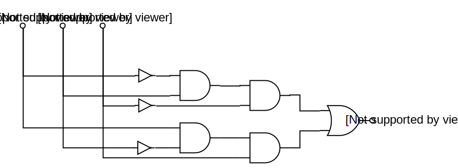
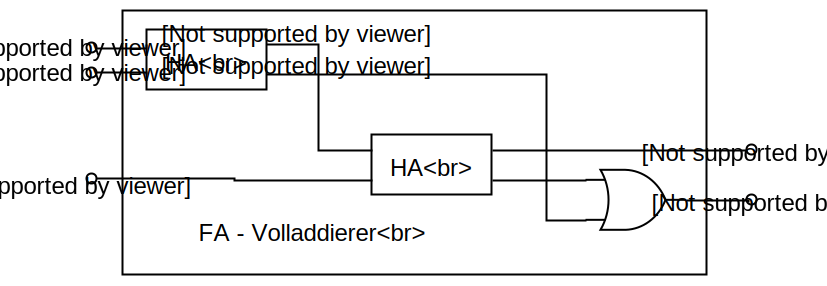
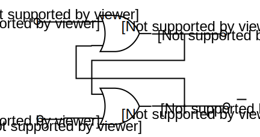
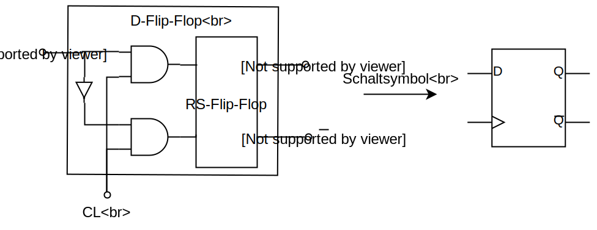
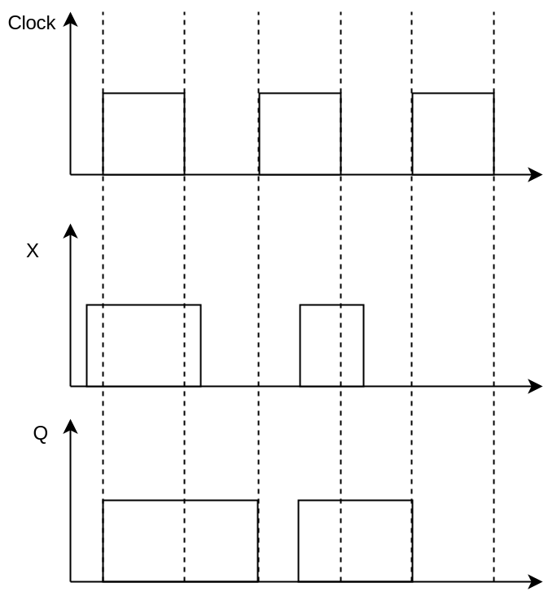

# Addierwerke in der arithmetisch logischen Einheit (ALU)
_aus der Vorlesung Rechnertechnik vom 21.03.2018_

---

$(x_1, x_2, x_3) = (0, 1, 0) \quad \overline{x_1} \wedge x_2 \wedge \overline{x_3}$
$(x_1, x_2, x_3) = (1,0,1)\quad x_1 \wedge \overline{x_2} \wedge x_3 \Rightarrow f_{(x_1, x_2, x_3)} = \overline{x_1} \wedge x_2 \wedge \overline{x_3} \wedge  x_1 \wedge \overline{x_2} \wedge x_3$

Mit den Schaltsymbolen
* `AND`

_Abbildung 1: `AND`-Gatter_

* `OR`

_Abbildung 2: `OR`-Gatter_

* `NOT`

_Abbildung 3: `NOT`-Gatter_

ergibt sich folgende Schaltung:

_Abbildung 4: Halbaddiererschaltung_

## Konstruktion der arithmetischen logischen Einheit (ALU)
Die arithmetisch logische Einheit besteht in der Regel aus Hardware zur Berechnung der vier Grundrechenarten und Logik-Hardware zur bitweisen Verknüpfung von Operanden.

Die Arithmetik der Gleitpunktzahlen ist auf die Arithmetik der Festpunktzahlen zurückführbar; z.B. indem die Exponenten so angepasst werden, dass die Mantissen ganzzahlig werden.

Es verwundert zunächst, dass mit einem Rechner, der nur Hardware für die Grundrechenarten besitzt, auch komplizierte Funktionen wie z.B. Sinus, Cosinus oder Logarithmen berechnet werden können. Solche Funktionen werden mit Hilfe von numerischen Verfahren wie z.B. Potenzreihenentwicklungen oder Tschebyscheff-Approximationen auf die Grundrechenarten zurückgeführt und die Algorithmen in Software-Bibliotheken hinterlegt.

### Addierwerke (Subtrahierwerke)
Die Addition von Dualzahlen verläuft analog der Addition der Dezimalzahlen mit Bildung eines Übertrags (_Carry_, $C$) und eines Restes ($R$).

| | | | | |
|:---:|:----:|:----:|:-----:|:-----|
| $x$ | $0$ | $1$ | $1$ | $1$ |
| $y$ | $-$ | | | $1$ |
| $C$ | $1$ | $1$ | $1$ | $0 \leftarrow$ |
| $R$ | $1$ | $0$ | $0$ | $0$ |

Für die erste Stelle wird ein Schaltnetz mit den Eingängen $X$ und $Y$ sowie den Ausgängen $C$ und $R$ konstruiert.

Die entsprechende Wahrheitstabelle sieht wie folgt aus:

| $X$ | $Y$ | $C$ | $R$ |
|:---:|:---:|:---:|:---:|
| $0$ | $0$ | $0$ | $0$ |
| $0$ | $1$ | $0$ | $1$ |
| $1$ | $0$ | $0$ | $1$ |
| $1$ | $1$ | $1$ | $0$ |

also $C = x \wedge y$ und $R = \overline{x} \wedge y \lor x \wedge \overline{y}$.

Das zugehörige Schaltnetz ist ein **Halbaddierer**.

_Abbildung 5: Schaltbild eines Halbaddierers_

Für die zweite und folgenden Stellen konstruiere man ein Schaltnetz mit den Eingängen $X$, $Y$ und $C_n$ sowie den Ausgängen $R$ und $C_{n + 1}$.

**Wahrheitstabelle für einen Volladdierer**

| $X$ | $Y$ | $C_n$ | $C_{n + 1}$ | $R$ |
|:---:|:---:|:---:|:---:|:---:|
| $0$ | $0$ | $0$ | $0$ | $0$ |
| $0$ | $0$ | $1$ | $0$ | $1$ |
| $0$ | $1$ | $0$ | $0$ | $1$ |
| $0$ | $1$ | $1$ | $1$ | $0$ |
| $1$ | $0$ | $0$ | $0$ | $1$ |
| $1$ | $0$ | $1$ | $1$ | $0$ |
| $1$ | $1$ | $0$ | $1$ | $0$ |
| $1$ | $1$ | $1$ | $1$ | $1$ |

**Entsprechendes Schaltnetz**

_Abbildung 6: Schaltnetz eines Volladdierers_

Um aus Halb- und Volladdierern ein Addierwerk aufzubauen, müssen die Summanden und die Summe in Registern gespeichert werden. Register sind aus 1-Bit Speicher, sogenannte **Flip-Flops**, aufgebaut. Das einfachste Flip-Flop ist das RS-Flip-Flop mit einem Set-Eingang (`S`) und einem Reset-Eingang (`R`).

**Wahrheitstabelle für ein RS-Flip-Flop**
| $R$ | $S$ | $Q$ | $\overline{Q}$ | |
|:---:|:---:|:---:|:---:|:---:|
| $0$ | $0$ | $Q$ | $\overline{Q}$ | stabile Speicherfunktion |
| $0$ | $1$ | $1$ | $0$ | `set` |
| $1$ | $0$ | $0$ | $1$ | `reset` |
| $1$ | $1$ | $0$ | $0$ | unzulässige Eingänge |

**Entsprechende Schaltung**

_Abbildung 7: Schaltung für einen RS-Flip-Flop_

Nun sollen Flip-Flops nicht zu jeder Zeit `set`- oder `reset`-Signale bearbeiten, sondern nur zu fest definierten Zeitpunkten. Zum Beispiel wird ein Operand, der auf den Leitungen des Datenbusses anliegt, zu einem bestimmten Zeitpunkt in ein Register übernommen.

Die Zeitpunkte, zu denen `set`- oder `reset`-Signalen bearbeitet werden, werden durch einen Taktgeber (_Clock_) bestimmt, welcher ein Taktsignal generiert.

Um `set`- und `reset`-Signale wirksam werden zu lassen, wenn das Taktsignal den Wert $1$ hat, wird die Schaltung des RS-Flip-Flops wie folgt erweitert:

Sei $x$ ein allgemeines (Daten-) Signal:

_Abbildung 8: Schaltnetz eines D-Flip-Flops_

**anschaulich**: Beispiel für den Signalverlauf von Clock, Flip-Flop-Eingang $X$ und Flip-Flop-Ausgang $Q$:

_Abbildung 9: Signalverlauf an einem D-Flip-Flop_

Es kann nun ein Addierwerk aus Halb- und Volladdierern und zwei Registern aufgebaut werden.

Dieses Addierwerk arbeitet wie folgt: Zunächst werden die beiden Summanden in die Register $X$ und $Y$ geladen. Für die Berechnung der lokalen Überträge $C_0$ bis $C_n$ vergeht in jedem Addierer einer einzelnen Bit-Stelle eine gewisse Verzögerungszeit $t_v$. Die Summe der beiden Summanden steht erst nach der Zeit $(n + 1) \cdot t_v$ stabil an den Ausgängen $R_0$ bis $R_{n - 1}$ an, da im pessimistischen Fall ein Übertrag durch alle Addierer hindurchgereicht werden muss. Da das Ergebnis nach einer Taktzeit von den Ausgängen $R_0$ bis $R_{n - 1}$ in ein Register geladen wird, gilt für die Dauer eines Taktes
$$
T > (n + 1) \cdot t_v,
$$

da $T$ so groß sein muss, dass alle Verknüpfungen sicher durchgeführt werden. Die Additionszeit dieses Addierwerks ist somit unabhängig davon, wieviele Bitstellen der Summanden mit $1$ belegt sind. Die Addition dauert für Zahlen der Länge $\frac{n}{2}$ genau so lang wie für Zahlen der Länge $n$.

### Der von-Neumann-Addierer
Der von-Neumann-Additionsalgorithmus führt zu einem schnelleren Addierwerk, bei dem im **Mittel** weniger Durchschaltzeiten notwendig sind.

Der Algorithmus läuft wie folgt ab:
1. Lade Summanden in $X$- und $Y$-Register.
2. Bilde komponentenweise die Summe aus $X_i$ und $Y_i$ (Bitstellen $X_i \ \text{mit} \ i = 0, \ldots, n - 1$) und speichere das Ergebnis in $X_i$.
Bilde komponentenweise die Überträge aus $X_i$ und $Y_i$ und speichere diese in $Y_{i + 1}$.
3. Ist irgendeine Bitstelle $Y_i$ im Register $Y$ ungleich 0 ($\neq 0$), so fahre bei Punkt 2. fort.

Sind alle $Y_i$ gleich 0, so terminiert der Algorithmus und die Summe steht im $X$-Register.

**Beispiel**:
| | | |
|:---:|:---:|:---:|
| 0. Durchlauf | $X^{(0)}$ | $0 \, 0 \, 1 \, 1 \, 0 \, 1 \, 0 \, 1$ |
| | $Y^{(0)}$ | $0 \, 0 \, 0 \, 1 \, 1 \, 0 \, 0 \, 1$ |
| 1. Durchlauf| $X^{(1)}$ | $0 \, 0 \, 1 \, 1 \, 1 \, 1 \, 0 \, 0$ |
| | $Y^{(1)}$ | $0 \, 0 \, 1 \, 0 \, 0 \, 0 \, 1 \, 0 \leftarrow$ |
| 2. Durchlauf | $X^{(2)}$ | $0 \, 0 \, 0 \, 0 \, 1 \, 1 \, 1 \, 0$ |
| | $Y^{(2)}$ | $0 \, 1 \, 0 \, 0 \, 0 \, 0 \, 0 \, 0 \leftarrow$ |
| 3. Durchlauf | $X^{(3)}$ | $0 \, 1 \, 0 \, 0 \, 1 \, 1 \, 1 \, 0$ |
| | $Y^{(3)}$ | $0 \, 0 \, 0 \, 0 \, 0 \, 0 \, 0 \, 0 \leftarrow$ |

Fertig, weil alle $Y_i = 0$.

### Abschätzung der Additionszeit beim von-Neumann-Addierer
Im schlechtesten Fall sind zur Addition von zwei $n$-stelligen Dualzahlen $n$ Durchläufe des Algorithmus erforderlich, da ein Übertrag mit jedem Durchlauf um mindestens eine Stelle im $Y$-Register "nach links" wandert und rechts eine $0$ nachgezogen wird.

:warning: Die **mittlere Anzahl** an Durchläufen ist jedoch wesentlich geringer. :warning:

_Dazu folgende Überlegung:_
Zu Beginn der Addition sind im $X$- und $Y$-Register im Mittel $\frac{n}{2}$ Bitstellen mit $1$ belegt.

Betrachte dazu $n = 2$:
Anzahl möglicher Eingangszustände:

| $x_1$ | $x_0$ |
|:---:|:---:|
| $0$ | $0$ |
| $0$ | $1$ |
| $1$ | $0$ |
| $1$ | $1$ |

Gesamtzahl der Einsen: $4$
Anzahl möglicher Zahlen: $2^2 = 4$
somit: mittlere Anzahl der Einsen pro Zahl ist: $\frac{4}{4} = 1 = \frac{n}{2}$.

$n = 4$

| $x_3$ | $x_2$ | $x_1$ | $x_0$ |
|:---:|:---:|:---:|:---:|
| $0$ | $0$ | $0$ | $0$ |
| $0$ | $0$ | $0$ | $1$ |
| $0$ | $0$ | $1$ | $0$ |
| $0$ | $0$ | $1$ | $1$ |
| $0$ | $1$ | $0$ | $0$ |
| $0$ | $1$ | $0$ | $1$ |
| $0$ | $1$ | $1$ | $0$ |
| $0$ | $1$ | $1$ | $1$ |
| $1$ | $0$ | $0$ | $0$ |
| $1$ | $0$ | $0$ | $1$ |
| $1$ | $0$ | $1$ | $0$ |
| $1$ | $0$ | $1$ | $1$ |
| $1$ | $1$ | $0$ | $0$ |
| $1$ | $1$ | $0$ | $1$ |
| $1$ | $1$ | $1$ | $0$ |
| $1$ | $1$ | $1$ | $1$ |

bei $n = 4 \rightarrow 2^n = 2^4 = 16$ mögliche Zahlen
Gesamtzahl der Einsen: $32$
mittlere Anzahl der Einsen pro Zahl: $\frac{32}{2^n} = \frac{32}{16} = 2$

günstigster Fall:
| | |
|:---:|:---|
| $X^{(0)}$ | $0101$ |
| $Y^{(0)}$ | $1010$ |
| $X^{(1)}$ | $1111$ |
| $Y^{(1)}$ | $0000 \leftarrow$ |

weniger günstiger Fall:
| | |
|:---:|:---|
| $X^{(0)}$ | $0101$ |
| $Y^{(0)}$ | $0100$ |
| $X^{(1)}$ | $0011$ |
| $Y^{(1)}$ | $1000 \leftarrow$ |
| $X^{(2)}$ | $1011$ |
| $Y^{(2)}$ | $0000 \leftarrow$ |

schlechtester Fall:
| | |
|:---:|:---|
| $X^{(0)}$ | $0101$ |
| $Y^{(0)}$ | $0011$ |
| $X^{(1)}$ | $0110$ |
| $Y^{(1)}$ | $0010 \leftarrow$ |
| $X^{(2)}$ | $0100$ |
| $Y^{(2)}$ | $0100 \leftarrow$ |
| $X^{(3)}$ | $0000$ |
| $Y^{(3)}$ | $1000 \leftarrow$ |
| $X^{(4)}$ | $1000$ |
| $Y^{(4)}$ | $0000 \leftarrow$ |

Aus den Tabellen erkennt man, dass sich die Anzahl der mit $1$ belegten Bitstellen im $Y$-Register bei jedem Durchlauf **im Mittel** halbiert.

Frage: Wieviele Durchläufe werden bei $n$-stelligen Dualzahlen im Mittel benötigt?
