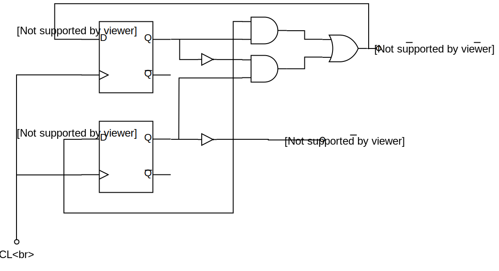
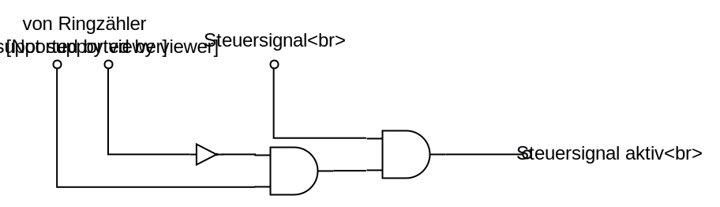
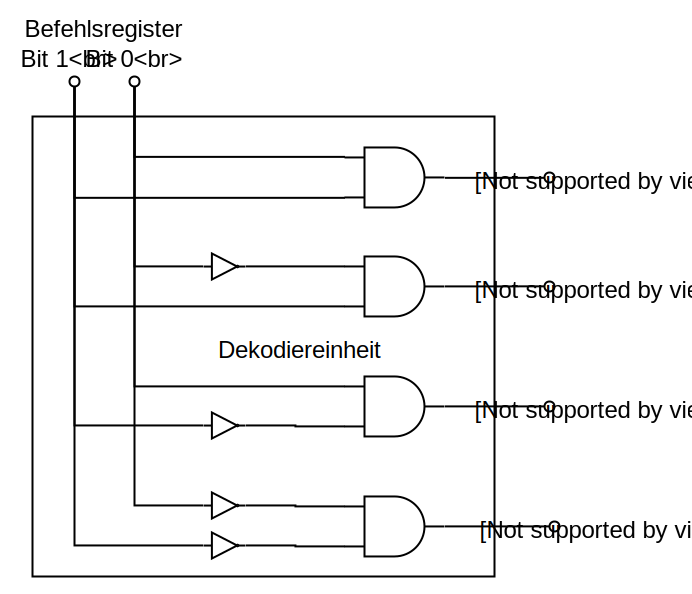
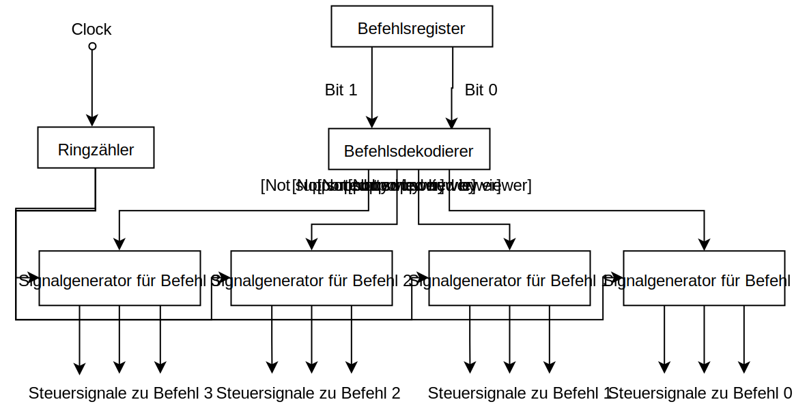
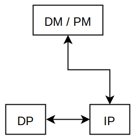
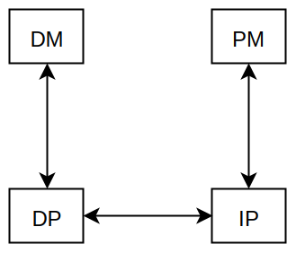
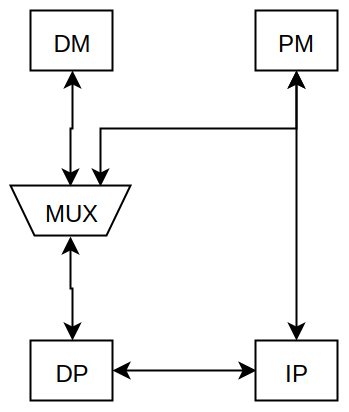
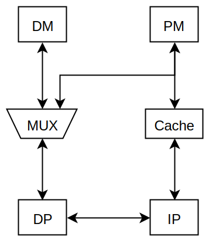

---
title: Rechnertechnik 22.03.2018
layout: default
permalink: Semester_4/Rechnertechnik/2018-03-22_rechnertechnik_md

---

# Das Steuerwerk und verschiedene Rechnerarchitekturen
_aus der Vorlesung Rechnertechnik vom 22.03.2018_

---

## Der von-Neumann-Additionsalgorithmus
**Frage**: Wieviele Durchläufe sind im Mittel erforderlich?
Wir haben gesehen:

0. Durchlauf: $\frac{n}{2}$ Bits mit $1$ belegt im $Y$-Register
1. Durchlauf: $\frac{1}{2} \cdot \frac{n}{2} = \frac{n}{4}$ Bits mit $1$ belegt im $Y$-Register
2. Durchlauf: $\frac{1}{2} \cdot \frac{n}{4} = \frac{n}{8}$ Bits mit $1$ belegt im $Y$-Register
3. ...

Also: nach dem $k$-ten Durchlauf sind $\frac{n}{2^{k + 1}}$ Bits mit $1$ belegt.

**Im Mittel** ist der von-Neumann-Additionsalgorithmus beendet, wenn $$
\frac{n}{2^{k + 1}} < 1
$$

oder
$$
\frac{n}{1} < 2^{k + 1} \rightarrow \log_2 (n) < k + 1 \rightarrow \log_2 (n) \le k
$$

ist.

**Fazit**: Das von-Neumann-Addierwerk benötigt im Mittel also nur $\log_2 (n)$ Durchschaltzeiten eines Halbaddierers, um eine Summe zu berechnen.

Der Takt muss nur ein wenig länger sein als die Durchschaltzeit eines Halbaddierers $T > t_{v_{\text{HA}}}$.

Gegenüber dem zuerst betrachteten Addierwerk mit $n$ Durchschaltzeiten eines Volladdierers pro Addition sind $\log_2 (n)$ Durchschaltzeiten eines Halbaddierers eine enorme (exponentielle) Beschleunigung; Außerdem werden nur $n$ Halbaddierer anstelle $n$ Volladdierer benötigt.

**Anmerkung**: Es gibt noch eine Vielzahl weiterer Additionsverfahren für Dualzahlen, die noch schneller sind als der von-Neumann-Algorithmus; diese benötigen aber viel mehr zusätzliche Hardware, z.B. zur schnelleren Berechnung des Übertrags, der sich dann nicht mehr durch eine Folge von Addierern fortpflanzen muss, sondern durch eine spezielle Hardware direkt berechnet wird (_Carry Look Ahead_).

----

## Konstruktion des Steuerwerks
Das Steuerwerk des Befehlsprozessors hat die Aufgabe, die Ausführung der Maschinenbefehle zu steuern. Dabei müssen Steuersignale erzeugt werden, die zeitlich passend zum ausführenden Maschinenbefehl bestimmte Teile des Datenprozessors, des I/O-Prozessors und des Arbeitsspeichers beeinflussen. Dabei werden Maschinenbefehle dekodiert und in unterschiedlichen Zeitphasen ausgeführt.

### Clock und Ringzähler
Um die Zeitphasen während der Ausführung eines Befehls zu erkennen, hat jeder Prozessor einen **Taktgeber** oder auch _Clock_. Der Taktgeber gibt mit dem Takt die kleinste Zeiteinheit (_Zeitscheibe_) an, in welcher sich Zustände im Rechner ändern können. Allerdings dauern die Ausführungsphasen in der Regel mehrere Takte.

Um innerhalb der Ausführungsphasen spezielle Zeitpunkte, z.B. zur Erzeugung eines Steuerbefehls, zu bestimmen, werden spezielle Schaltwerke eingesetzt, die so genannten **Ringzähler**.

Man nehme beispielsweise an, dass in einem Rechner bestimmte Befehle mit Zeitphasen von 4 Takten arbeiten. Dazu wird ein Ringzähler _modulo 4_ eingesetzt, der ermöglicht, den 0., 1., 2., und 3. Takt dieser Zeitphasen zu erkennen.

Dazu folgende Wahrheitstabelle:

| Takt | $x_2$ | $x_1$ | $f_2$ | $f_1$ |
|:---:|:---:|:---:|:---:|:----:|
| $0$ | $0$ | $0$ | $0$ | $1$ |
| $1$ | $0$ | $1$ | $1$ | $0$ |
| $2$ | $1$ | $0$ | $1$ | $1$ |
| $3$ | $1$ | $1$ | $0$ | $0$ |

$f_1 = \overline{x_1} \wedge \overline{x_2} \lor x_2 \wedge \overline{x_1}$
$\quad \, = \overline{x_1} \wedge (x_2 \lor \overline{x_2})$
$\quad \, = \overline{x_1} \wedge 1$
$f_1 = \overline{x_1}$

$f_2 = x_1 \wedge \overline{x_2} \lor \overline{x_1} \wedge x_2$

entsprechendes Schaltnetz:

_Abbildung 1: Schaltnetz eines Ringzählers_

**modulo 5 Ringzähler**:

| Takt | $x_3$ | $x_2$ | $x_1$ | $f_3$ | $f_2$ | $f_1$ |
|:---:|:---:|:---:|:---:|:---:|:---:|:---:|
| $0$ | $0$ | $0$ | $0$ | $0$ | $0$ | $1$ |
| $1$ | $0$ | $0$ | $1$ | $0$ | $1$ | $0$ |
| $2$ | $0$ | $1$ | $0$ | $0$ | $1$ | $1$ |
| $3$ | $0$ | $1$ | $1$ | $1$ | $0$ | $0$ |
| $4$ | $1$ | $0$ | $0$ | $0$ | $0$ | $0$ |

$f_1 = \overline{x_1} \wedge \overline{x_2} \wedge \overline{x_3} \lor \overline{x_1} \wedge x_2 \wedge \overline{x_3}$
$\quad \, = (\overline{x_1} \wedge \overline{x_3}) \wedge (\overline{x_2} \lor x_2)$
$\quad \, = \overline{x_1} \wedge \overline{x_3}$

Soll nun ein Steuersignal zu einem ganz bestimmten Takt aktiv werden, so kann dies mittels des Ringzählers und einer zusätzlichen Dekodierlogik realisiert werden.

Zum Beispiel kann mit nachfolgender Schaltung das Steuersignal nur in Takt $2$ aktiv werden:

_Abbildung 2: Dekodierlogik des Steuersignals_

### Dekodierung der Maschinenbefehle und Erzeugung
Jeder Maschinenbefehl ist in einer einzigartigen Bitkombination kodiert. Somit kann eine Dekodierlogik konstruiert werden, mit der alle Maschinenbefehle eindeutig unterschieden werden können. Zum Beispiel kann als Ausgang der Dekodierlogik für jeden Befehl eine eigene Steuerleitung existieren, deren Pegel $1$ ist, wenn der Befehl erkannt wurde.

**Beispiel**: Betrachte Dekodiereinrichtung für 4 Maschinenbefehle

_Abbildung 3: Schaltnetz einer Dekodiereinheit_

Mit Hilfe des Ringzählers können nun die notwendigen Steuersignale zur Ausführung eines bestimmten Befehls zum richtigen Zeitpunkt ausgeführt werden, indem das Signal aus dem Befehlsdekodierer zur richtigen Zeit als Steuersignal an die Hardware weitergeleitet wird.

Dies könnte zum Beispiel so realisiert sein, dass zu jedem dekodierten Maschinenbefehl eine separate Hardware zur Erzeugung der Steuersignale verwendet wird. Bei realen Prozessoren gibt es natürlich gleichzeitig ausgeführte Steuersignale bei unterschiedlichen Maschinenbefehlen.

**Beispiel**: Erzeugung von Steuersignalen für 4 Maschinenbefehle

_Abbildung 4: Schema zur Erzeugung von 4 Maschinenbefehlen_ 

## Harvard-Architektur
Zur Erinnerung: Rechnerarchitekturen nach dem von-Neumann-Konzept sind gekennzeichnet durch einen gemeinsamen Hauptspeicher für Programmdaten und Verarbeitungsdaten. Die Architektur besteht vereinfacht aus drei Einheiten. Der genannte Hauptspeicher fasst Datenspeicher (_Data Memory_ (DM)) und Programmspeicher (_Program Memory_ (PM)).

Wesentlich ist, dass zu einer Zeit nur ein Zugriff auf den Hauptspeicher erfolgen kann; somit kann zu einer Zeit entweder ein Befehl (Programmdaten) oder ein Operand (Verarbeitungsdaten) aus dem Hauptspeicher geladen werden. Der Befehlsprozessor (_Instruction Processor_ (IP)) ist dafür zuständig, die Maschinenbefehle einschließlich Operanden aus dem Hauptspeicher zu laden und zu dekodieren. Die Ausführung des Befehls erfolgt durch den Datenprozessor (_Data Processor_ (DP)), der dafür unter anderem eine ALU enthält.

**von-Neumann-Konzept**

_Abbildung 5: Die von-Neumann-Architektur_

Um die oben genannten Beschränkungen der von-Neumann-Architektur zu umgehen, bedient man sich der **Harvard-Architektur**, bei der Datenspeicher (DM) und Programmspeicher (PM) als separate Speicher organisiert sind.

**Klassische Harvard-Architektur**

_Abbildung 6: Die Harvard-Architektur_

Hier kann zu einer Zeit ein Befehl durch den Befehlsprozessor und ein Operand durch den Datenprozessor geladen werden.

Die klassische Harvard-Architektur wurde durch eine architektonische Maßnahme erweitert, die es dem Datenprozessor ermöglicht, direkt auch auf den Programmspeicher zuzugreifen, um beispielsweise Filterkoeffizienten zu laden. Die zusätzliche Hardware ist ein Multiplexer (MUX).

_Abbildung 7: Modifizierte Harvard-Architektur_

---

Um den Durchsatz an Instruktionen noch mehr zu steigern, wurde eine weitere Optimierung durch zusätzliche Hardware vorgenommen. Es wurde zusätzlicher Cache-Speicher am Befehlsprozessor integriert.

_Abbildung 8: Modifizierte Harvard-Architektur mit Cache_

Die Modifizierte Harvard-Architektur und die Modifizierte Harvard-Architektur mit Cache findet man hauptsächlich bei Digitalen Signal-Prozessoren (DSPs).
